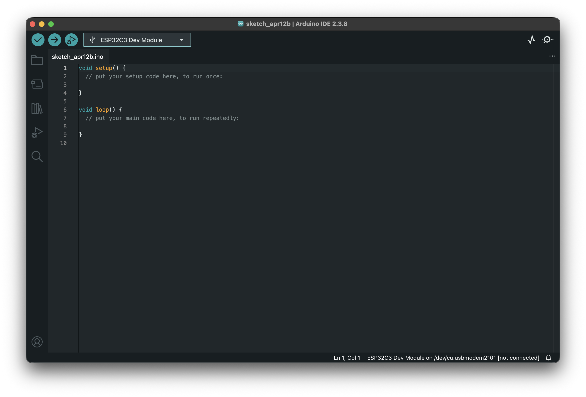
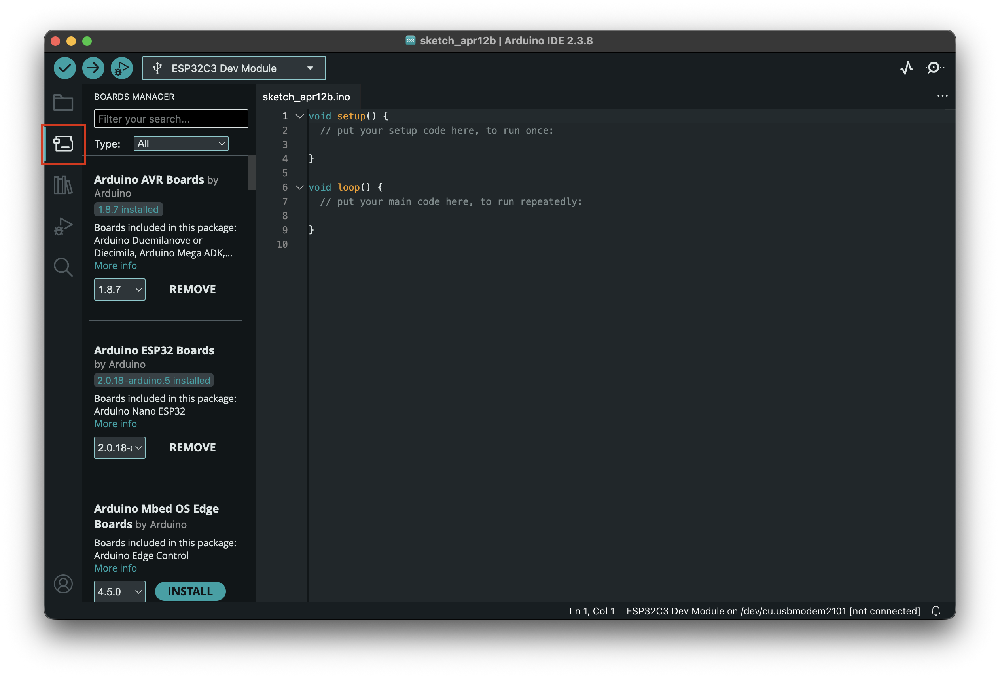
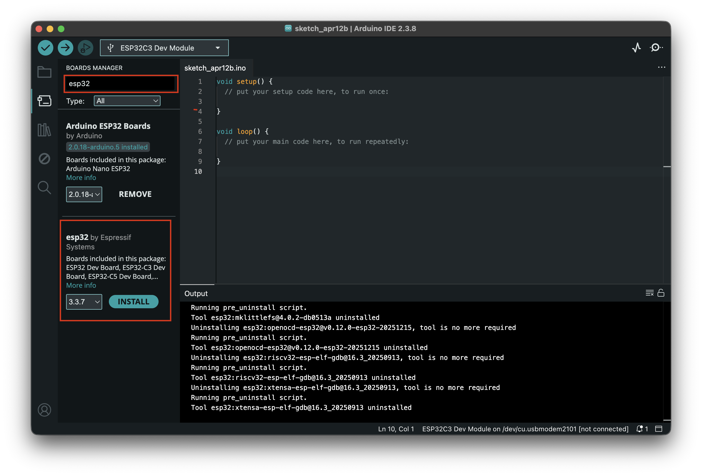
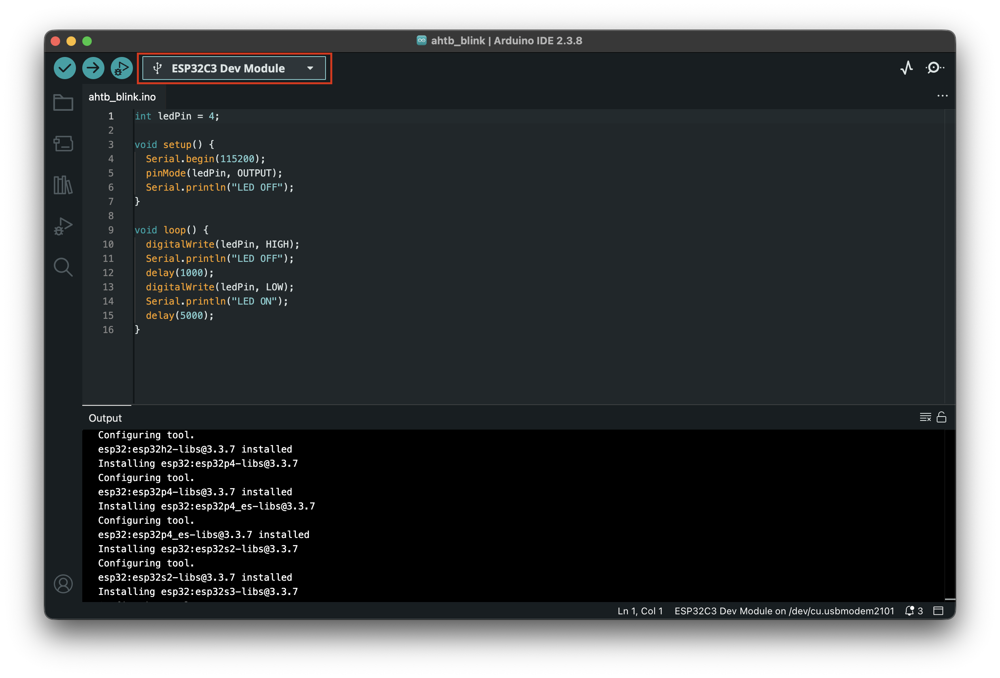
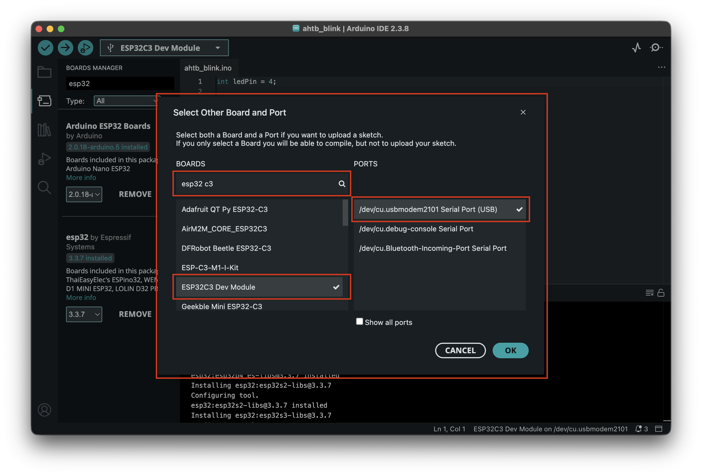
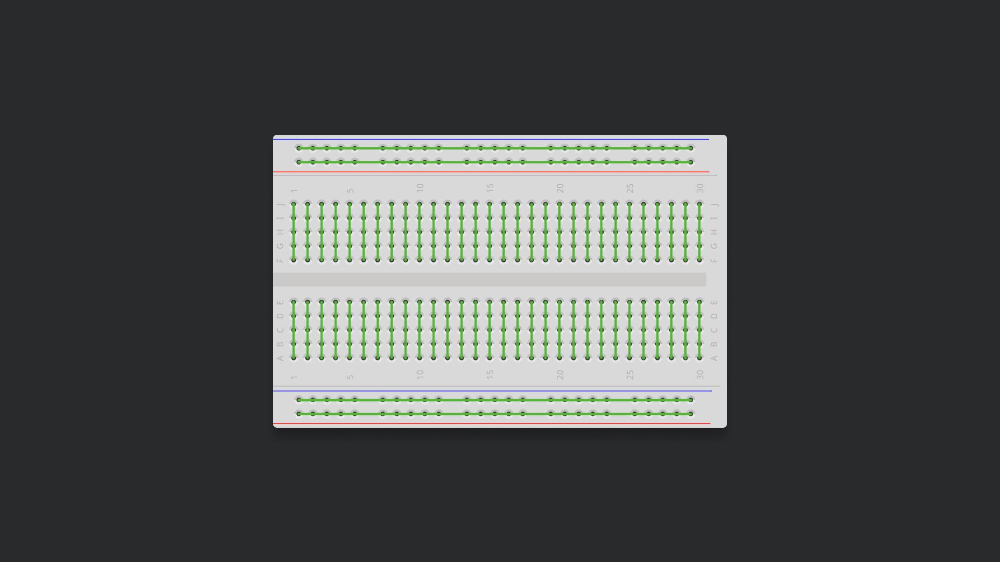

# Session 02


## 1. Installing the Arduino IDE

1. Go to [Arduino.cc/en/software](https://www.arduino.cc/en/software/) and download the latest version of the Arduino IDE
2. Open the downloaded file and follow the install instructions (PC) / Drag into your Applications Folder (MAC)
3. Open Arduino IDE



---

## 2. Installing the ESP Board via the Boards Manager

1. In the left column click on "Boards Manager"
2. In the search field type "esp32"
3. Look for "esp32 by espressif" and press install
4. Wait for the installation to complete



---

## 3. Connect to your ESP32 Board

1. Take out the provided USB-C cable and connect it both to the ESP32 and your Laptop. Use the Adapter if needed.
2. The ESP32 should show a red LED indicating its powered on
3. Locate the two small buttons on the board called "BOOT" and "RST"
4. Press and hold the BOOT Button. While still holding, also press and release the "RST" button. Now release the BOOT Button. This should bring your ESP32 into Download Mode.
5. To upload programs to the ESP32, you need to select the correct board.
6. In the top bar click the Board Dropdown and select "Select other board and port"
7. In the popup type in the search bar "ESP32C3 Dev Module" and select it
8. The right window shows your ports. There should be a port with "(USB)" - select it
9. Press OK




---

## 4. Blink = Hello World (Basic Syntax)
Arduino Code is written mostly in a variant of C++, which is made specific for the Arduino environment. Like in every programming language, it is important that you are precise in your syntax.

### 1. Basic Program Structure
**Setup**

This is everything that runs once. Things will be turned on or activated from here. Runs only at the beginning of the program, hence when you upload code/turn the ESP on. These functions need to be called for the program to work – they can be empty though.

```cpp
void setup() {
  // Code is happening in here
}
```

**Loop**

This is everything that runs forever. Like LEDs blinking, motors spinning, you name it.

```cpp
void loop() {
  // Code is happening here
}
```


### 2. Adressing Pins
Arduino IDE has some built-in **functions** that are use to address the different parts of the ESP32. The most basic is called `digitalWrite()`. It is used to adress a pin on the board and regulate it Output. LOW is off, while HIGH is on.

Between the brackets of the function you write the values you want to pass to it.

So to turn on a pin you need to write:

```cpp
digitalWrite(8, HIGH);
```

To turn it off respectively:

```cpp
digitalWrite(8, LOW);
```

Line endings are always marked with `;`

We need to make sure the pin configured to put stuff out - this needs only to happen once:
    
```cpp
pinMode(8, OUTPUT);
```


### 3. Time
**Time** is calculated in Milliseconds (ms). If you put a delay() in your code, the program waits for that time to do the next thing. 

```cpp
delay(1000);
```

### 4. Blink Onboard LED
The internal LED of the ESP is at Pin 8. Lets blink it. After running this code a blue LED on the ESP should Blink.

```cpp
void setup() {
  pinMode(8, OUTPUT);
}

void loop() {
  digitalWrite(8, HIGH); 
  delay(1000);                     
  digitalWrite(8, LOW); 
  delay(1000);                     
}
```

---

## 5. Breadboards
The breadboard allows you to quickly and easily build electronic circuits without soldering by simply plugging in components and wires. Its internal connections look like this:




---

## 6. Blink the LED from the Kit
1. Find the Red LED in the Kit
2. The LED has two "legs". The longer one is positive (+), the shorter one negative (-).
3. Connect the + to Pin 4, - to G (Ground)

Instead of changing all the 8s in the code to 4s we can use variables. Variables need to be defined before the the main code gets executed.

```c++
int LedPin = 4;
```

Here are some of the basic variable types in Arduino:

| Type                           | Description                                                          | Example                          |
|---------------------------------|----------------------------------------------------------------------|----------------------------------|
| **int**                        | Integer type. Stores whole numbers                                   | `int counter = 0;`               |
| **float**                      | Floating point number. Stores decimal numbers                        | `float temperature = 24.6;`      |
| **double**                     | Double-precision floating point. Behaves like `float`                | `double distance = 10.25;`       |
| **char**                       | Character type. Stores a single character                            | `char letter = 'A';`             |
| **boolean**                    | Stores `true` or `false`                                             | `boolean isOn = false;`          |
| **byte**                       | 8-bit unsigned number (0–255)                                        | `byte sensorValue = 128;`        |
| **String**                     | Stores a string of text (note: capital S)                            | `String name = "ESP32";`         |
| **unsigned int, unsigned long**| Unsigned versions of numeric types for only positive values           |                                  |

Example usage:
```c++
int ledPin = 4;           // Pin number (integer)
float voltage = 5.0;      // Decimal number
char grade = 'A';         // Character
boolean isActive = true;  // True or false
```


The new code should look like this:

```
int ledPin = 4;

void setup() {
  pinMode(ledPin, OUTPUT);
}

void loop() {
  digitalWrite(ledPin, HIGH); 
  delay(1000);                     
  digitalWrite(ledPin, LOW); 
  delay(1000);                     
}
```
