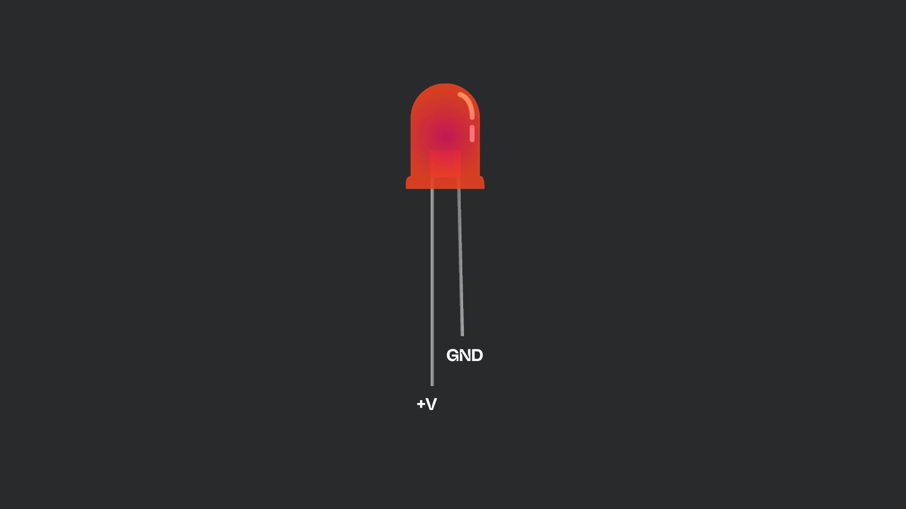
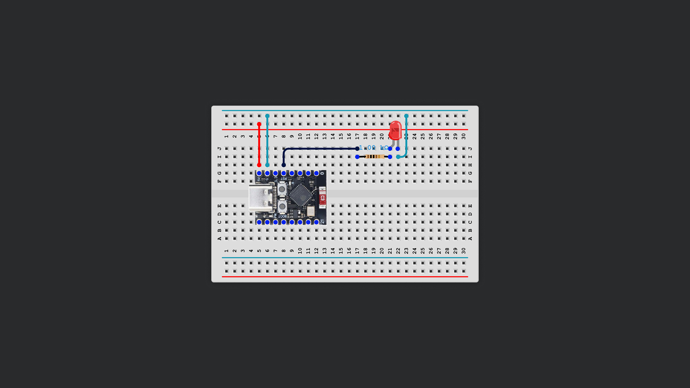
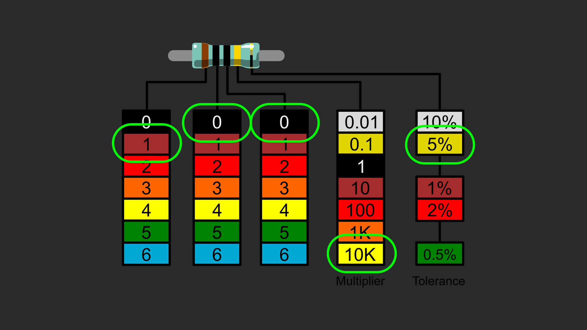
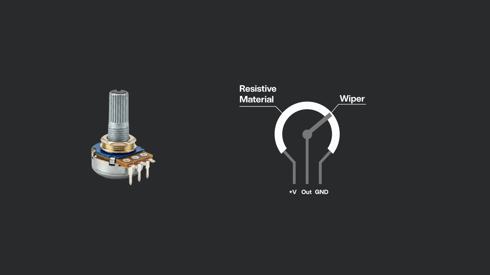
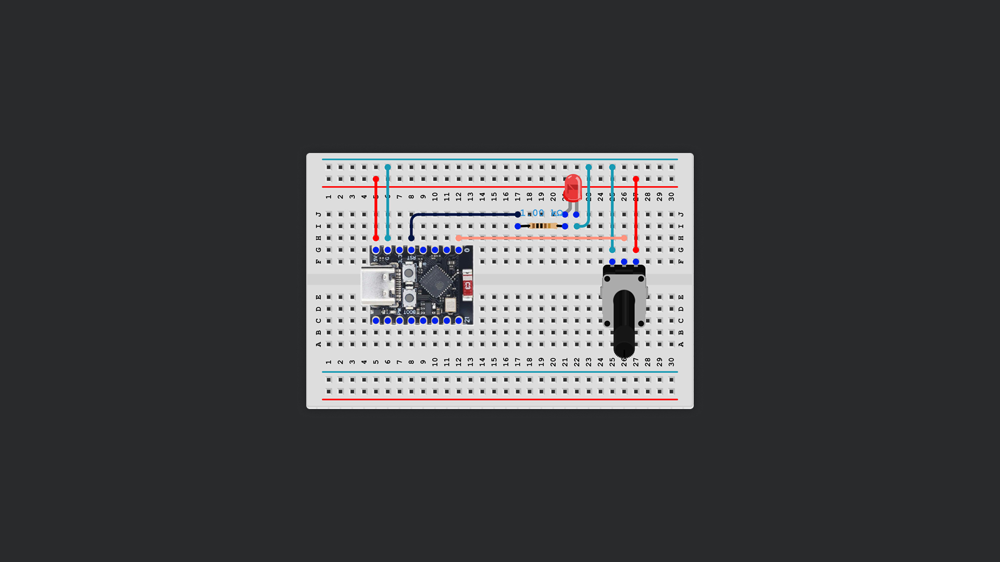
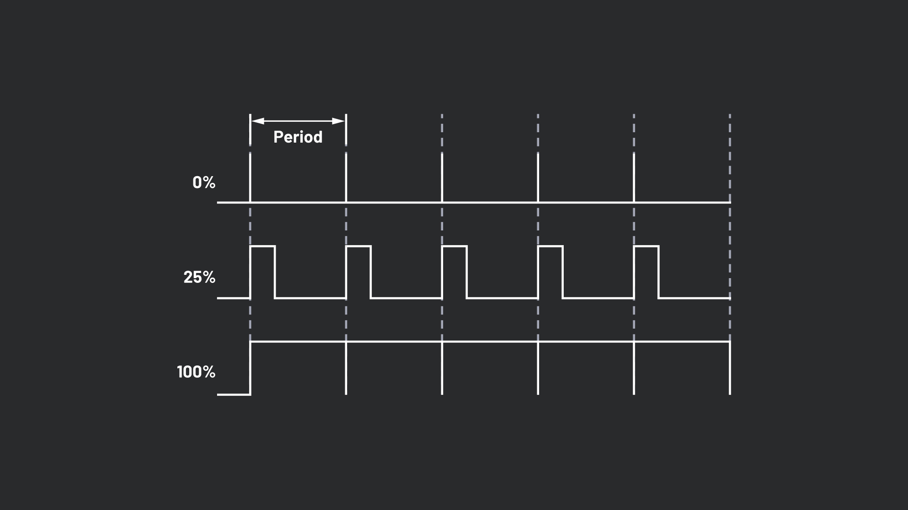

# Session 03


## 1. Blink the LED from the Kit (Again)

1. Find the Red LED in the Kit
2. The LED has two "legs". The longer one is positive (+), the shorter one negative (-).
3. Connect the + to Pin 4, - to G (Ground)


Instead of changing all the pin numbers in the code, we can use variables. Variables need to be defined before the the main code gets executed.

```c++
int LedPin = 4;
```
<details>
<summary>Basic variable types in Arduino:</summary>

| Type                           | Description                                                          | Example                          |
|---------------------------------|----------------------------------------------------------------------|----------------------------------|
| **int**                        | Integer type. Stores whole numbers                                   | `int counter = 0;`               |
| **float**                      | Floating point number. Stores decimal numbers                        | `float temperature = 24.6;`      |
| **double**                     | Double-precision floating point. Behaves like `float`                | `double distance = 10.25;`       |
| **char**                       | Character type. Stores a single character                            | `char letter = 'A';`             |
| **boolean**                    | Stores `true` or `false`                                             | `boolean isOn = false;`          |
| **byte**                       | 8-bit unsigned number (0–255)                                        | `byte sensorValue = 128;`        |
| **String**                     | Stores a string of text (note: capital S)                            | `String name = "ESP32";`         |
| **unsigned int, unsigned long**| Unsigned versions of numeric types for only positive values           |                                  |

</details>

Example usage:
```c++
int ledPin = 4;           // Pin number (integer)
float voltage = 5.0;      // Decimal number
char grade = 'A';         // Character
boolean isActive = true;  // True or false
```


The new code should look like this:

```
int ledPin = 4;

void setup() {
  pinMode(ledPin, OUTPUT);
}

void loop() {
  digitalWrite(ledPin, HIGH); 
  delay(1000);                     
  digitalWrite(ledPin, LOW); 
  delay(1000);                     
}
```

---

## 2. Voltage, Amplitude, Watts

In order to not burn things, we need to learn the basics of electricity. 

- **Voltage:** How hard the electricity is pushing
- **Amplitude:** How much electricity is moving. More Amps ➔ Brigher LEDs
- **Watts:** Measurement Unit of Power

```
Watts = Volts x Amps
```

---

## 3. Resistors

When connecting an LED to a power source (like an Arduino), you must use a **resistor** in series with the LED. Without a resistor, **too much current** can flow through the LED. This will cause the LED to get very hot and quickly burn.

LEDs only need a small current (usually around 20mA). Directly connecting them to a power supply (like 5V) will push way more current through them than they can handle. By adding a resistor, you "slow down" the flow of electricity so only a safe amount reaches the LED.


#### **Choosing a Resistor Value for an LED**

The resistor value depends on the LED's specs and the supply voltage. For a 5V Arduino and a standard red LED (forward voltage ~2V):

```
Resistor (ohms) = (Supply Voltage - LED Forward Voltage) / Desired Current
                = (5V - 2V) / 0.02A = 150Ω
```

#### **Resistor Cheat Sheet**
Normally the first band is a little bit closer to the edge or wider. Most of the time the Tolerance is either gold or silver and on the very right.

Find the 150Ω Resistor and place it in the circuit. The LED should be more dim now.

[Online Calculator](https://www.calculator.net/resistor-calculator.html)




---

## 4. Print Messages to the Serial Port

Printing messages to the Serial Port allows you to monitor what's happening inside your Arduino. This is incredibly useful for debugging and understanding your program.

Let's extend our LED blink example to print messages when the LED turns on and off.

`Serial.begin(9600);` initializes communication between the Arduino and your computer at a speed of 9600 bits per second.  

`Serial.print("Your message");` sends the message to the Serial Monitor.

`Serial.println("Your message");` sends the message to the Serial Monitor and makes a new line.

> With the ESP32-C3 Super Mini, you have to enable the Serial Port before uploading your sketch. This needs to be to by going to `Tools > USB CDC on Boot > Choose "Enabled"`


**Updated Code:**

```cpp
int ledPin = 4;

void setup() {
  pinMode(ledPin, OUTPUT);
  Serial.begin(9600);
}

void loop() {
  digitalWrite(ledPin, HIGH);
  Serial.println("LED is ON"); 
  delay(1000);

  digitalWrite(ledPin, LOW);
  Serial.println("LED is OFF");
  delay(1000);
}
```

#### **How to View Serial Messages**

1. Upload the code to your Arduino board.
2. In the Arduino IDE, go to **Tools > Serial Monitor** (or CMD/Ctrl + Shift + M).
3. Set the baud rate of the Serial Monitor to **9600**.
4. You should see messages like:
   ```
   LED is ON
   LED is OFF
   LED is ON
   LED is OFF
   ```
   

---

## 5. Potentiometer
A potentiometer is a variable resistor that is be used to adjust voltage. Turning the knob changes the resistance, which lets you vary the output signal. 



#### **Connecting a LED directly to the Potentiometer**
The potentiometer has three pins. When you look at it from the front the Pins are +V (positive), Output, and GND (negative)

1. Connect the LED directly to 5V and Ground.
2. Wire the potentiometer before the LED – just like a normal resistor
3. Turn the knob and fade the LED



#### **Reading out the Potentiometer**
The Arduino reads the output pin voltage of the potentiometer using an analog pin.

**Analog pins** can read varying voltage levels (not just on or off) and provide a value from 0 to 1023 representing that voltage. The function `analogRead(Pin)` reads out the values of the pin. It should do this for each loop iteration, so we put it at the beginning of `void loop()`

```cpp
potValue = analogRead(potPin);
```

Let's just **print** the potPin value out to see what we get.

Now we learn about **if-conditions**. 

```cpp
if (something > other) {
    Serial.println("Something is bigger than other");
} else {
    Serial.println("It's still smaller");
}
```

**Example Code – Broken Down in Steps:**

1. **Define pins and variables**
    ```cpp
    int ledPin = 4;
    int potPin = A0;
    int potValue = 0;
    int threshold = 600;
    ```

2. **Initialize the pins and Serial in setup**
    ```cpp
    void setup() {
      pinMode(ledPin, OUTPUT);
      Serial.begin(9600);
    }
    ```

3. **Read potentiometer, check value, and control LED**
    ```cpp
    void loop() {
      // 3.1. Read potentiometer value
      potValue = analogRead(potPin);

      // 3.2. Compare with threshold and turn LED on or off
      if (potValue > threshold) {
        digitalWrite(ledPin, HIGH);

        // 3.3. Print status to Serial
        Serial.print("Potentiometer: ");
        Serial.print(potValue);
        Serial.println("  LED is ON");
      } else {
        digitalWrite(ledPin, LOW);

        Serial.print("Potentiometer: ");
        Serial.print(potValue);
        Serial.println("  LED is OFF");
      }

      // 3.4. Small delay for readability
      delay(50);
    }

  ```

#### **Pulse-Width-Modulation & analogWrite()** 


Pulse Width Modulation (PWM) lets us dim the LED by controlling how much of the time it's on, rather than just turning it fully on or off. The Arduino function to access this is called `analogWrite()`

```cpp
analogWrite(ledPin, brightness);
```

The `map()` function in Arduino re-scales a number from one range to another, such as converting a sensor input (0–1023) to an LED brightness value (0–255).

```cpp
map(potValue, 0, 1023, 0, 255);
```

**Example Code:**

```cpp
int ledPin = 4;
int potPin = A0;

int potValue = 0;

void setup() {
  pinMode(ledPin, OUTPUT);
  Serial.begin(9600);
}

void loop() {
  potValue = analogRead(potPin);
  int brightness = map(potValue, 0, 1023, 0, 255);
  analogWrite(ledPin, brightness);

  Serial.print("Potentiometer: ");
  Serial.print(potValue);
  Serial.print("  LED brightness: ");
  Serial.println(brightness);

  delay(50);
}
```

---

## 6. Wifi Indicator & Arduino Libraries
The ESP32 has WiFi onboard. But natively, in the Arduino IDE there is no functions for WiFi. You can extend the functionality of your programs by using **libraries**. 

Libraries are generally imported at the very top of your program – like this:

```cpp
#include <WiFi.h> //No semicolon needed!
```

The WiFi library is provided with your Arduino download, but other libraries will need to be installed seperately.

1. Connect the LED with a fitting resistor to pin 4.
2. Import the Wifi Library
   ```cpp
   #include <WiFi.h>
   ```
3. The ESP needs to know the name and password of the WiFi it should connect to.
   ```cpp
   char *ssid = "mySsid";
   char *password = "myPassword"; 
   ```
   

4. Define the LED Pin.  
  ```cpp
  int ledPin = 4;
  ```
  This tells the ESP32 which pin the LED is connected to (GPIO 4, in this case).


5. Set pinMode and begin Serial. For stability, we add a short delay after this
  ```c++
  void setup() { 
    pinMode(ledPin, OUTPUT); 
    digitalWrite(ledPin, LOW);  
    Serial.begin(115200);  
    delay(500);  
    
  ```

6. Still inside the setup function we need to place some WiFi settings. 
  ```cpp
  WiFi.mode(WIFI_STA); //Sets the ESP32 to "station mode" so it can connect to an existing WiFi network.
  WiFi.disconnect(true); //Ensures the ESP32 isn't connected to any WiFi before trying to join the new network.
  delay(100); 

  WiFi.begin(ssid, password); //Starts connecting to the WiFi network with the credentials you provided.
  WiFi.setTxPower(WIFI_POWER_8_5dBm); //(Important only for the ESP-C3) Sets the WiFi transmit power.
  ```

7. This loop keeps checking if the ESP32 is connected to WiFi. It prints a dot to the serial monitor every 0.5 seconds until the connection is successful. It reads out the `WiFi.status()` function. The `!=` operator means "not equal".   
```cpp
    while (WiFi.status() != WL_CONNECTED) {
      delay(500);
      Serial.println('.');
    }
```
    
8. Once the condition of the while loop is not fulfilled anymore (that means `WiFi.status() = WL_CONNECTED`) the rest of the code is executed. Let's print out the IP-Adress of the ESP and turn on the LED.
```cpp
    Serial.print("Connected, IP: ");
    Serial.println(WiFi.localIP());
    digitalWrite(LED_PIN, HIGH); 
```
   
9. The loop is empty as we're doing this only once. 
  ```cpp
  void loop() {

  }
  ```


<details>
<summary>Code</summary>

```cpp
#include <WiFi.h>

char *ssid = "mySsid";
char *password = "myPassword";

int ledPin = 4;

void setup() {
  pinMode(ledPin, OUTPUT);
  digitalWrite(ledPin, LOW);

  Serial.begin(115200);
  delay(500);

  WiFi.mode(WIFI_STA);
  WiFi.disconnect(true);
  delay(100);
  WiFi.begin(ssid, password);
  WiFi.setTxPower(WIFI_POWER_8_5dBm);

  while (WiFi.status() != WL_CONNECTED) {
    delay(500);
    Serial.print('.');
  }

  Serial.println();
  Serial.print("Connected, IP: ");
  Serial.println(WiFi.localIP());

  digitalWrite(LED_PIN, HIGH);
}

void loop() {

}
```

</details>

---

## 7. Wifi Traffic LED

In the spirit of Lukas Trunigers work, lets try to create somewhat of a network. The following example detects WiFi packets in the Network and blinks the LED accordingly. 

1. **Includes the WiFi library for network connectivity**
   ```cpp
   #include <WiFi.h>
   ```

2. **Includes ESP32-specific WiFi functions for packet sniffing**
   ```cpp
   #include "esp_wifi.h"
   ```

3. **Set your network's SSID and password**
   ```cpp
   char *ssid = "YOUR_SSID";
   char *password = "YOUR_PASSWORD";
   ```

4. **Defines the pin number for the LED**
   ```cpp
   int LED_PIN = 4;
   ```

5. **Sets how long (in milliseconds) the LED stays on after detecting WiFi traffic**
   ```cpp
   unsigned long LED_ON_TIME_MS = 35;
   ```

6. **Stores the time the last WiFi packet was detected**
   ```cpp
   unsigned long lastPacketMs = 0;
   ```

7. **Callback function: Updates the last packet time when a WiFi data packet is received**
   ```cpp
   void onWiFiPacket(void *buf, wifi_promiscuous_pkt_type_t type) {
     if (type != WIFI_PKT_DATA) {
       return;
     }
     lastPacketMs = millis();
   }
   ```

8. **Sets up the LED, serial communication, WiFi connection, and packet sniffing**
   - **8.1. Set the LED pin as output and turn it off at first**
     ```cpp
     pinMode(LED_PIN, OUTPUT);
     digitalWrite(LED_PIN, LOW);
     ```
   - **8.2. Start serial communication for debugging output**
     ```cpp
     Serial.begin(115200);
     delay(500);
     ```
   - **8.3. Set WiFi mode to 'station' and begin connecting to access point**
     ```cpp
     WiFi.mode(WIFI_STA);
     WiFi.begin(ssid, password);
     ```
   - **8.4. Wait in a loop until the ESP32 successfully connects to WiFi and print connection status**
     ```cpp
     Serial.print("Connecting");
     while (WiFi.status() != WL_CONNECTED) {
       delay(500);
       Serial.print(".");
     }
     Serial.println();
     Serial.print("Connected, IP address: ");
     Serial.println(WiFi.localIP());
     ```
   - **8.5. Set up packet sniffing: register callback and enable promiscuous mode**
     ```cpp
     esp_wifi_set_promiscuous_rx_cb(onWiFiPacket);
     esp_wifi_set_promiscuous(true);
     ```

9. **Turns the LED on if a WiFi packet was recently detected, otherwise turns it off**
   ```cpp
   void loop() {
     unsigned long now = millis();
     unsigned long when = lastPacketMs;

     if (now - when <= LED_ON_TIME_MS) {
       digitalWrite(LED_PIN, HIGH);
     } else {
       digitalWrite(LED_PIN, LOW);
     }
   }
   ```


> **Promiscuous mode** is a special setting for network devices (like the ESP32’s WiFi chip) that allows them to receive all wireless packets on the channel, not just those addressed to them.  
>  
> This is essential for tasks like packet sniffing or monitoring WiFi activity nearby. In the example above, `esp_wifi_set_promiscuous(true)` enables this mode, and the callback `onWiFiPacket` gets called for each captured packet, letting us detect when any packet is seen (regardless of sender or recipient).


<details>
<summary>**Full Code**</summary>

```cpp
#include <WiFi.h>
#include "esp_wifi.h"

// ----- change these for your network -----
char *ssid = "YOUR_SSID";
char *password = "YOUR_PASSWORD";

int LED_PIN = 4;

unsigned long LED_ON_TIME_MS = 35;

unsigned long lastPacketMs = 0;

void onWiFiPacket(void *buf, wifi_promiscuous_pkt_type_t type) {
  if (type != WIFI_PKT_DATA) {
    return;
  }
  lastPacketMs = millis();
}

void setup() {
  pinMode(LED_PIN, OUTPUT);
  digitalWrite(LED_PIN, LOW);

  Serial.begin(115200);
  delay(500);

  WiFi.mode(WIFI_STA);
  WiFi.begin(ssid, password);

  Serial.print("Connecting");
  while (WiFi.status() != WL_CONNECTED) {
    delay(500);
    Serial.print(".");
  }
  Serial.println();
  Serial.print("Connected, IP address: ");
  Serial.println(WiFi.localIP());

  esp_wifi_set_promiscuous_rx_cb(onWiFiPacket);
  esp_wifi_set_promiscuous(true);
}

void loop() {
  unsigned long now = millis();
  unsigned long when = lastPacketMs;

  if (now - when <= LED_ON_TIME_MS) {
    digitalWrite(LED_PIN, HIGH);
  } else {
    digitalWrite(LED_PIN, LOW);
  }
}
```

</details>

---

## 8. Buttons


When the button is pressed, it completes (closes) the circuit, allowing your Arduino to *detect* the button press.

#### Internal Pullup
A pullup resistor ensures that the input pin reads a defined HIGH voltage when the button is not pressed, preventing unreliable or floating readings.


```cpp
int buttonPin = 3;   
int ledPin = 4;      

void setup() {
  pinMode(buttonPin, INPUT_PULLUP); // Enables the pin's internal pull-up resistor
  pinMode(ledPin, OUTPUT);
}

void loop() {
  int buttonState = digitalRead(buttonPin);

  if (buttonState == LOW) {         
    digitalWrite(ledPin, HIGH);     
  } else {
    digitalWrite(ledPin, LOW);      
  }
}
```


#### External Pullup

The downside of a internal pullup is that it can be unrelieable, especially on small devices. This is how to wire an external pullup:


In the code we just change this line:

```cpp
pinMode(buttonPin, INPUT); // Remove _PULLUP
```

#### 


