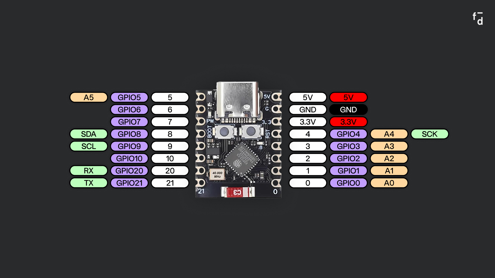
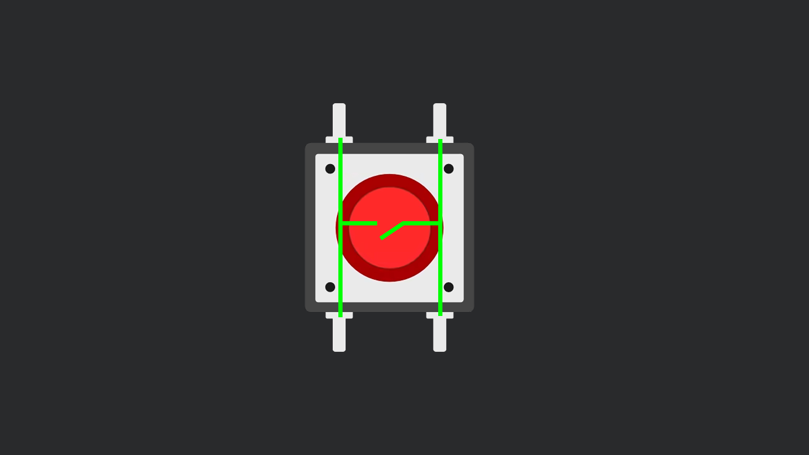
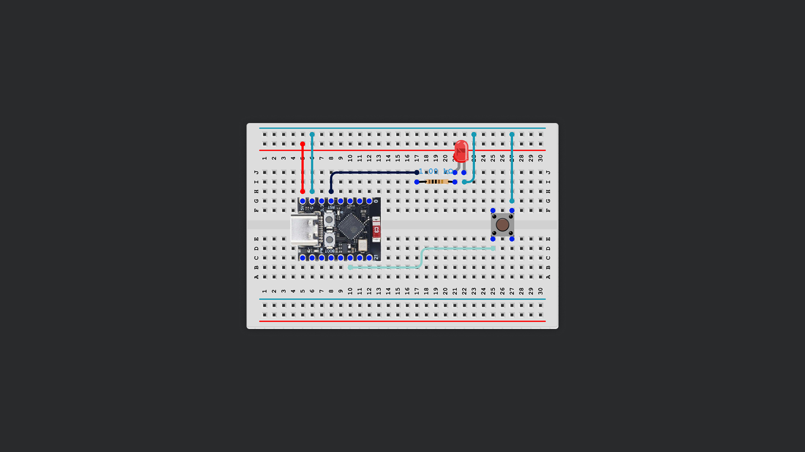
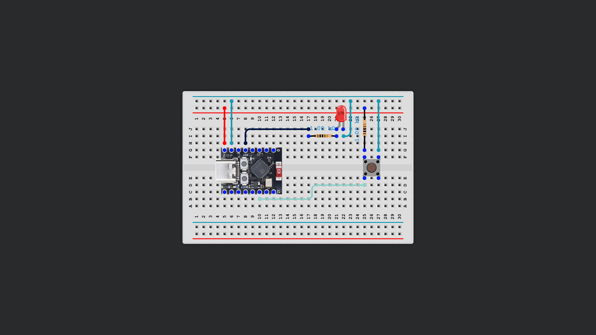
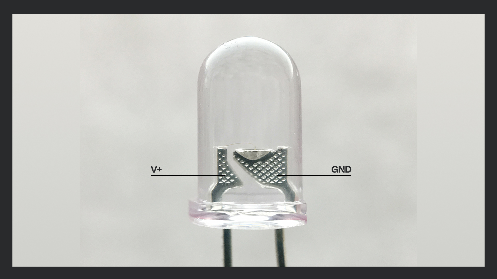
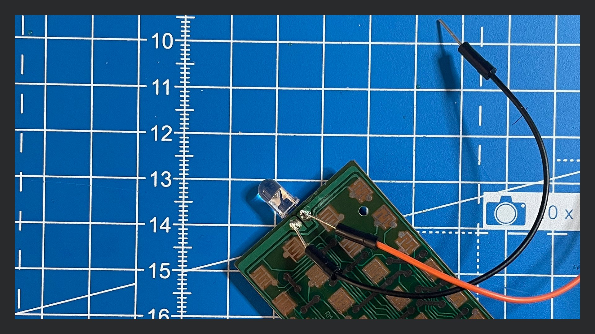
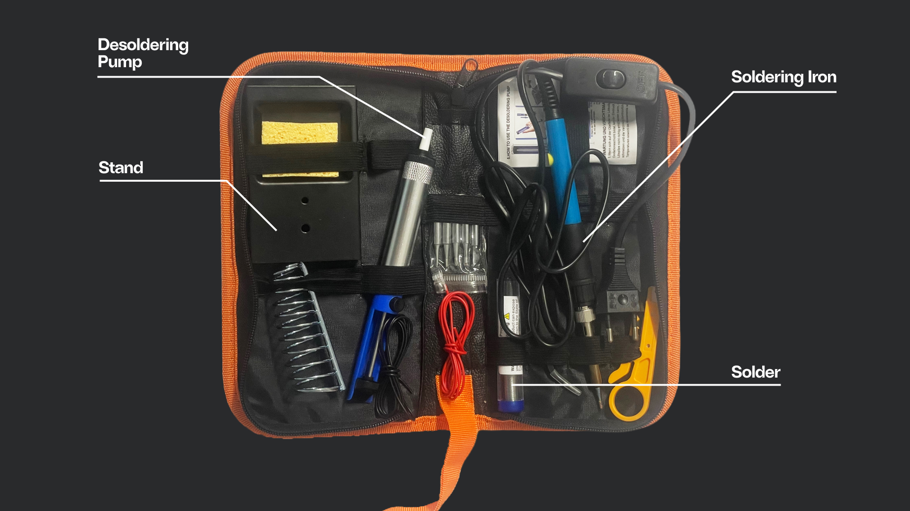
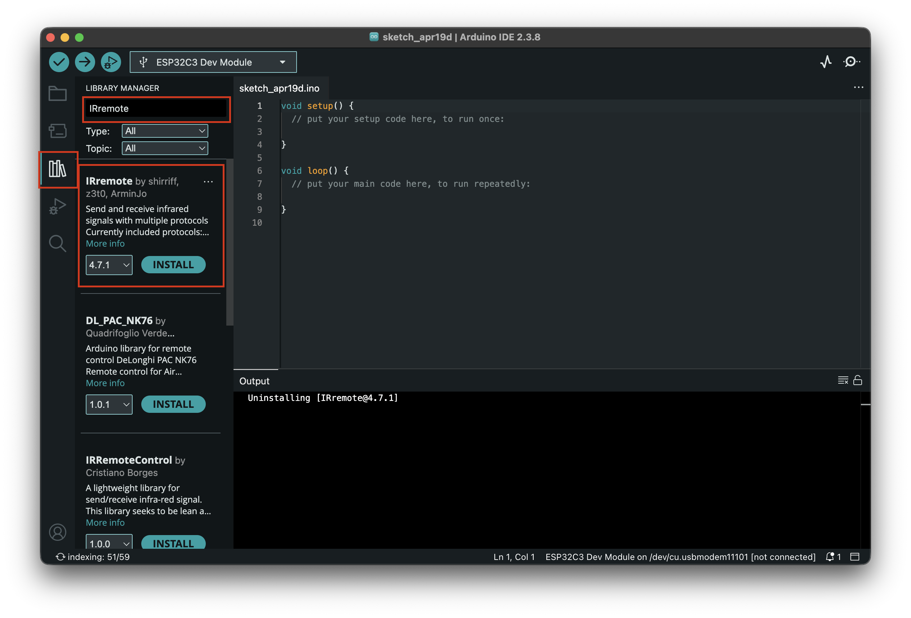

# Session 04





## 1. Wifi Indicator & Arduino Libraries
The ESP32 has WiFi onboard. But natively, in the Arduino IDE there is no functions for WiFi. You can extend the functionality of your programs by using **libraries**. 

Libraries are generally imported at the very top of your program – like this:

```cpp
#include <WiFi.h> //No semicolon needed!
```

The WiFi library is provided with your Arduino download, but other libraries will need to be installed seperately.

1. **Connect the LED with a fitting resistor to pin 4.**
2. **Import the Wifi Library**
   ```cpp
   #include <WiFi.h>
   ```
3. **The ESP needs to know the name and password of the WiFi it should connect to.**
   ```cpp
   char *ssid = "mySsid";
   char *password = "myPassword"; 
   ```
   

4. **Define the LED Pin.**
  ```cpp
  int ledPin = 4;
  ```
  This tells the ESP32 which pin the LED is connected to (GPIO 4, in this case).


5. **Set pinMode and begin Serial. For stability, we add a short delay after this**
  ```c++
  void setup() { 
    pinMode(ledPin, OUTPUT); 
    digitalWrite(ledPin, LOW);  
    Serial.begin(115200);  
    delay(500);  
    
  ```

6. **Still inside the setup function we need to place some WiFi settings.** 
  ```cpp
  WiFi.mode(WIFI_STA); //Sets the ESP32 to "station mode" so it can connect to an existing WiFi network.
  WiFi.disconnect(true); //Ensures the ESP32 isn't connected to any WiFi before trying to join the new network.
  delay(100); 

  WiFi.begin(ssid, password); //Starts connecting to the WiFi network with the credentials you provided.
  WiFi.setTxPower(WIFI_POWER_8_5dBm); //(Important only for the ESP-C3) Sets the WiFi transmit power.
  ```

    
7. **Print out the IP-Adress of the ESP and turn on the LED.**
```cpp
    Serial.print("Connected, IP: ");
    Serial.println(WiFi.localIP());
    digitalWrite(ledPin, HIGH); 
```
   
8. **The loop is empty as we're doing this only once.**
  ```cpp
  void loop() {

  }
  ```


<details>
<summary>**Full Code**</summary>

```cpp
#include <WiFi.h>

char *ssid = "mySsid";
char *password = "myPassword";

int ledPin = 4;

void setup() {
  pinMode(ledPin, OUTPUT);
  digitalWrite(ledPin, LOW);

  Serial.begin(115200);
  delay(500);

  WiFi.mode(WIFI_STA);
  WiFi.disconnect(true);
  delay(100);
  WiFi.begin(ssid, password);
  WiFi.setTxPower(WIFI_POWER_8_5dBm);

  // Optional: Print a dot if not connected
  /*
  while (WiFi.status() != WL_CONNECTED) {
    delay(500);
    Serial.print('.');
  }
  */

  Serial.println();
  Serial.print("Connected, IP: ");
  Serial.println(WiFi.localIP());

  digitalWrite(ledPin, HIGH);
}

void loop() {

}
```

</details>

>You can deactivate lines of code by commenting them out. If a line in C++ starts with `//` it will not be executed. Multiple lines will can be deactivated between `/*` and `*/`


---

## 2. Wifi Traffic LED

In the spirit of Lukas Trunigers work, lets try to create somewhat of a network. The following example detects WiFi packets in the Network and blinks the LED accordingly. 

1. **Includes the WiFi library for network connectivity**
   ```cpp
   #include <WiFi.h>
   ```

2. **Includes ESP32-specific WiFi functions for packet sniffing**
   ```cpp
   #include "esp_wifi.h"
   ```

3. **Set your network's SSID and password**
   ```cpp
   char *ssid = "YOUR_SSID";
   char *password = "YOUR_PASSWORD";
   ```

4. **Defines the pin number for the LED**
   ```cpp
   int LED_PIN = 4;
   ```

5. **Sets how long (in milliseconds) the LED stays on after detecting WiFi traffic**
   ```cpp
   unsigned long LED_ON_TIME_MS = 35;
   ```

6. **Stores the time the last WiFi packet was detected**
   ```cpp
   unsigned long lastPacketMs = 0;
   ```

7. **Callback function: Updates the last packet time when a WiFi data packet is received**
   ```cpp
   void onWiFiPacket(void *buf, wifi_promiscuous_pkt_type_t type) {
     if (type != WIFI_PKT_DATA) {
       return;
     }
     lastPacketMs = millis();
   }
   ```

8. **Sets up the LED, serial communication, WiFi connection, and packet sniffing**
   - **8.1. Set the LED pin as output and turn it off at first**
     ```cpp
     pinMode(LED_PIN, OUTPUT);
     digitalWrite(LED_PIN, LOW);
     ```
   - **8.2. Start serial communication for debugging output**
     ```cpp
     Serial.begin(115200);
     delay(500);
     ```
   - **8.3. Set WiFi mode to 'station' and begin connecting to access point**
     ```cpp
     WiFi.mode(WIFI_STA);
     WiFi.begin(ssid, password);
     ```
   - **8.4. Wait in a loop until the ESP32 successfully connects to WiFi and print connection status**
     ```cpp
     Serial.print("Connecting");
     while (WiFi.status() != WL_CONNECTED) {
       delay(500);
       Serial.print(".");
     }
     Serial.println();
     Serial.print("Connected, IP address: ");
     Serial.println(WiFi.localIP());
     ```
   - **8.5. Set up packet sniffing: register callback and enable promiscuous mode**
     ```cpp
     esp_wifi_set_promiscuous_rx_cb(onWiFiPacket);
     esp_wifi_set_promiscuous(true);
     ```

9. **Turns the LED on if a WiFi packet was recently detected, otherwise turns it off**
   ```cpp
   void loop() {
     unsigned long now = millis();
     unsigned long when = lastPacketMs;

     if (now - when <= LED_ON_TIME_MS) {
       digitalWrite(LED_PIN, HIGH);
     } else {
       digitalWrite(LED_PIN, LOW);
     }
   }
   ```


> **Promiscuous mode** is a special setting for network devices (like the ESP32’s WiFi chip) that allows them to receive all wireless packets on the channel, not just those addressed to them.  
>  
> This is essential for tasks like packet sniffing or monitoring WiFi activity nearby. In the example above, `esp_wifi_set_promiscuous(true)` enables this mode, and the callback `onWiFiPacket` gets called for each captured packet, letting us detect when any packet is seen (regardless of sender or recipient).


<details>
<summary>**Full Code**</summary>

```cpp
#include <WiFi.h>
#include "esp_wifi.h"

// ----- change these for your network -----
char *ssid = "YOUR_SSID";
char *password = "YOUR_PASSWORD";

int LED_PIN = 4;

unsigned long LED_ON_TIME_MS = 35;

unsigned long lastPacketMs = 0;

void onWiFiPacket(void *buf, wifi_promiscuous_pkt_type_t type) {
  if (type != WIFI_PKT_DATA) {
    return;
  }
  lastPacketMs = millis();
}

void setup() {
  pinMode(LED_PIN, OUTPUT);
  digitalWrite(LED_PIN, LOW);

  Serial.begin(115200);
  delay(500);

  WiFi.mode(WIFI_STA);
  WiFi.begin(ssid, password);

  Serial.print("Connecting");
  while (WiFi.status() != WL_CONNECTED) {
    delay(500);
    Serial.print(".");
  }
  Serial.println();
  Serial.print("Connected, IP address: ");
  Serial.println(WiFi.localIP());

  esp_wifi_set_promiscuous_rx_cb(onWiFiPacket);
  esp_wifi_set_promiscuous(true);
}

void loop() {
  unsigned long now = millis();
  unsigned long when = lastPacketMs;

  if (now - when <= LED_ON_TIME_MS) {
    digitalWrite(LED_PIN, HIGH);
  } else {
    digitalWrite(LED_PIN, LOW);
  }
}
```

</details>

---

## 3. Buttons



When the button is pressed, it completes (closes) the circuit, allowing your Arduino to *detect* the button press.

#### Internal Pullup
A pullup resistor ensures that the input pin reads a defined HIGH voltage when the button is not pressed, preventing unreliable or floating readings.




```cpp
int buttonPin = 10;   
int ledPin = 4;      

void setup() {
  pinMode(buttonPin, INPUT_PULLUP); // Enables the pin's internal pull-up resistor
  pinMode(ledPin, OUTPUT);
}

void loop() {
  int buttonState = digitalRead(buttonPin);

  if (buttonState == LOW) {         
    digitalWrite(ledPin, HIGH);     
  } else {
    digitalWrite(ledPin, LOW);      
  }
}
```


#### External Pullup

The downside of a internal pullup is that it can be unrelieable, especially on small devices. This is how to wire an external pullup:



In the code we just change this line:

```cpp
pinMode(buttonPin, INPUT); // Remove _PULLUP
```


## 4. Hacking an infrared remote

Infrared (IR) LEDs work the same as regular ones, but they emit light that can not be seen by the human eye. 
An IR remote works by using an infrared LED to send coded pulses of invisible light to a receiver in your device. The receiver interprets these pulses as specific commands, such as turning the TV On/Off, changing the channel or adjusting the volume.

### Accessing the IR-LED

1. **Get access to the insides if the remote.**
   Find a way to open up the remote. Most consist of two plastic shells that are either held together by plastic clips or small screws. 

2. **Examine the IR-LED.**
   If written on the Circuit Board note down or mark the polarity. If not, either find out with a multimeter or by locating the "Anvil" (The bigger "plate" inside the bulb)

   

3. **Wire the LED**
   a. Solder a cable directly to each soldering point on the PCB. Connect the other ends to the Arduino – Pin 4 and Ground
   

   b. **Or** desolder the LED by applying heat to both soldering points at the same time. When the solder liquifies carfully pull out the LED with a pair of tweezers. After getting the LED out successfully mark polarity and connect on the breadboard to Pin 4 and Ground.




### Installing an external library (IRremote)

External Arduino libraries are add-on packages created by others that provide extra functionality not included in the basic Arduino software, such as controlling sensors, displays, or communication protocols. They make it easier to use complex hardware or features by offering pre-written code that you can include at the top of your own Arduino sketches.

We will install a library that makes coded infrared communication easier.

1. In the left menu column click the 3rd button from top for "Arduino Libraries".
2. Search for "IRremote".
3. Install "IRremote" by shirriff.



### Send out a signal with a button press.

1. **Include the library**
   ```cpp
   #include <IRremote.hpp>
   ```
2. **Define the Pins**
   ```cpp
   #define IR_LED_PIN 4
   #define BUTTON_PIN 3
   ```

3. **Setup Function**
   Set up the PinMode for the Button and begin serial communication. `IrSender.begin(IR_LED_PIN)` sets our LED Pin to the correct PinMode for IR Communication.
   ```cpp
   void setup() {
    pinMode(BUTTON_PIN, INPUT_PULLUP);
    Serial.begin(9600);

    IrSender.begin(IR_LED_PIN);
    
    delay(100);
    Serial.println("ready"); 
    }
    ```

4. **sendMessage function to send a single char**
   Create a new function below `void loop()`. We will call this function in the loop afterwards. The `IrSender.sendNEC()` function sends out the letter 'E'
   
   ```cpp
   void sendMessage() {
    IrSender.sendNEC((uint16_t)(uint8_t)'E', 0, 0);
   }
   ```

5. **Send message on button press**
   ```cpp
   void loop() {
      if (digitalRead(BUTTON_PIN) == LOW) {
        sendMessage();
        Serial.println("sent."); 
        delay(1000); // avoid repeat
      }
    }
    ```

<details>
<summary>**Full Code**</summary>

```cpp
#include <IRremote.hpp>

#define IR_LED_PIN 4
#define BUTTON_PIN 3


void setup() {
  pinMode(BUTTON_PIN, INPUT_PULLUP);
  Serial.begin(9600);

  IrSender.begin(IR_LED_PIN);
  
  delay(100);
  Serial.println("ready"); 
}

void loop() {
  if (digitalRead(BUTTON_PIN) == LOW) {
    sendMessage();
    Serial.println(" sent."); 
    delay(1000); // debounce / avoid repeat
  }
}

void sendMessage() {
  IrSender.sendNEC((uint16_t)(uint8_t)'E', 0, 0);
}
```

</details>

### Send out a String
Extend the example from above. Right now there is no way for the receiver to define the end of a message. This can be helped by sending a specific character that states that the string ended. A bit like saying "over" on a walkie talkie. 

We will use the character for "newline" `\n`.

1. **Define the Message**
   ```cpp
   String message = "HELLO"; //change this!
   ```

2. Setup stays the same.
3. Inside `void loop()` we need to pass the string variable to our sendMessage() function by writing the variable name ("message") inside the curved brackets.
   
   While we're at it – let's print that to the serial port aswell
   ```cpp
   sendMessage(message);

   Serial.print(message);
   Serial.println(" sent."); 
   ```
4. In our `sendMessage()` function we need to find out the length of our string and then send each character seperately. 
   
   ```cpp
   for (int i = 0; i < msg.length(); i++) {
   char c = msg[i];

   // send each character as 8-bit value
   IrSender.sendNEC((uint16_t)(uint8_t)c, 0, 0); 

   delay(100); // small gap between characters
   }

   ```
  
5. Send out the termination character
   ```cpp
   IrSender.sendNEC((uint16_t)(uint8_t)'\n', 0, 0);
   ```

<details>
<summary>**Full Code**</summary>

```cpp
#include <IRremote.hpp>

#define IR_LED_PIN 4
#define BUTTON_PIN 3

String message = "HELLO";  // change this!

void setup() {
  pinMode(BUTTON_PIN, INPUT_PULLUP);
  Serial.begin(9600);

  IrSender.begin(IR_LED_PIN);
  
  delay(100);
  Serial.println("ready"); 
}

void loop() {
  if (digitalRead(BUTTON_PIN) == LOW) {
    sendMessage(message);
    Serial.print(message);
    Serial.println(" sent."); 
    delay(1000); // debounce / avoid repeat
  }
}

void sendMessage(String msg) {
  for (int i = 0; i < msg.length(); i++) {
    char c = msg[i];

    // send each character as 8-bit value
    IrSender.sendNEC((uint16_t)(uint8_t)c, 0, 0); 

    delay(100); // small gap between characters
  }

  // send termination character (newline)
  IrSender.sendNEC((uint16_t)(uint8_t)'\n', 0, 0);
}
```

</details>


