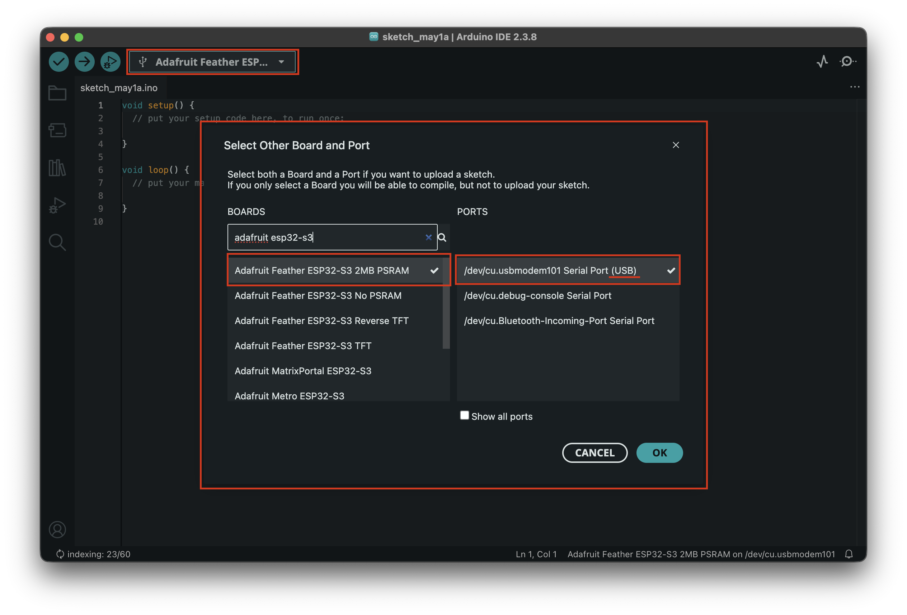
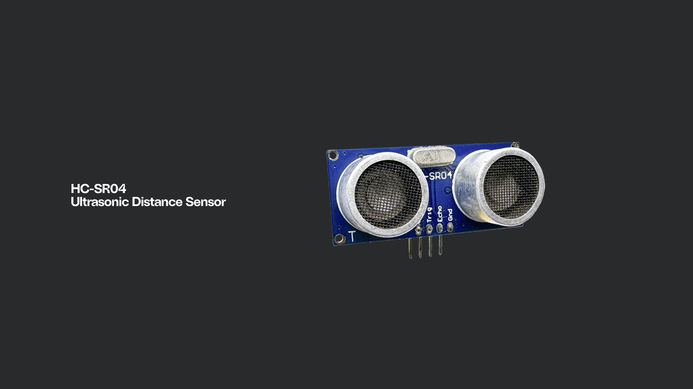
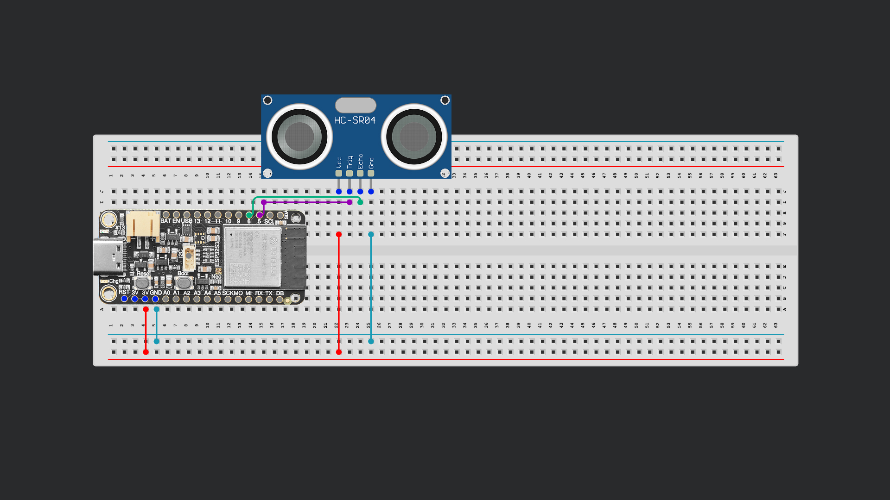
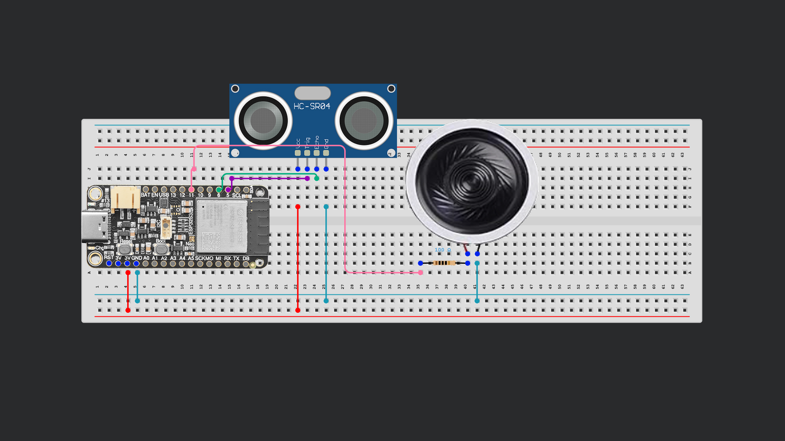
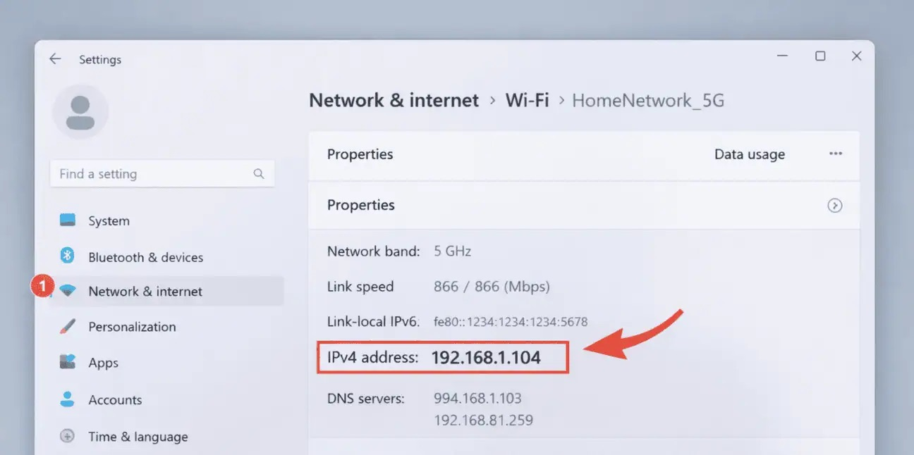
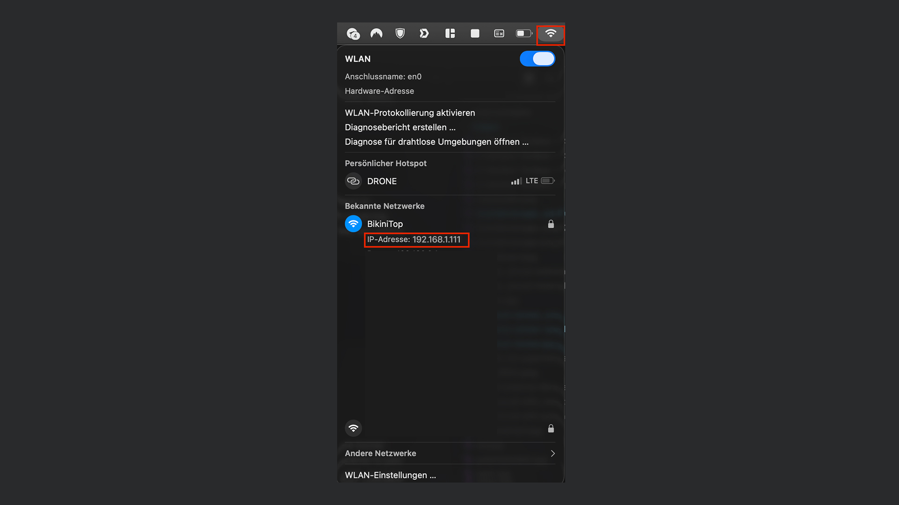
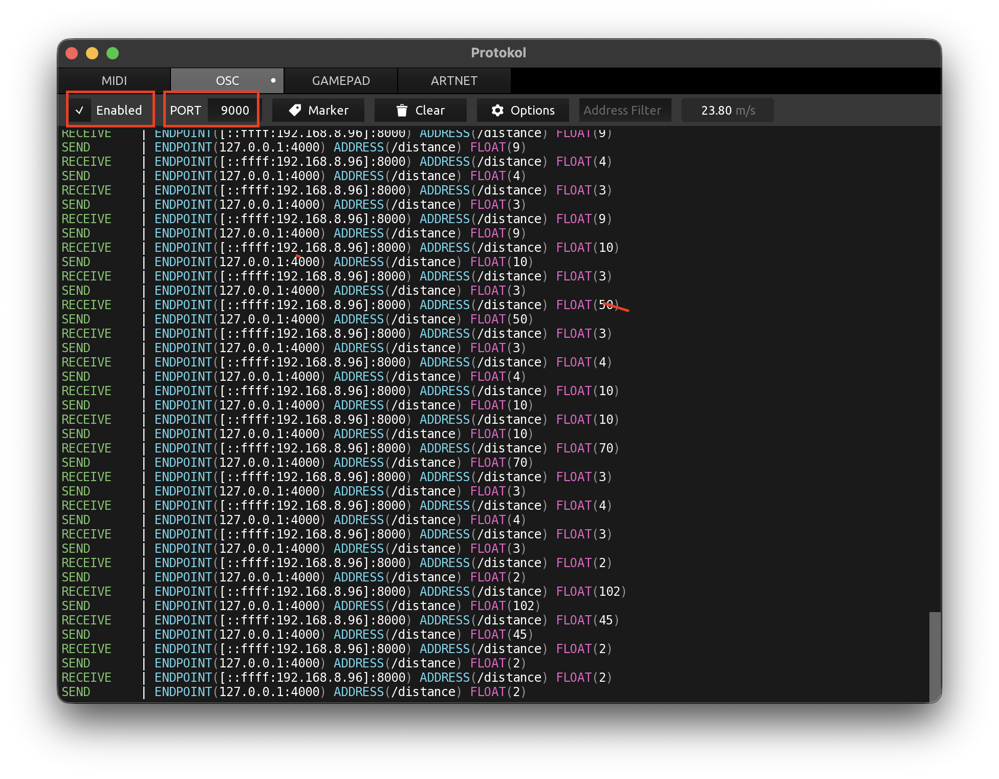

# Session 06


## 1. Using the new ESP board

In your Toolkit you'll find the bigger **ESP32 S3 Feather** board. To use we have to select it in the Board Manager by searching for: 

### **Adafruit Feather ESP32-S3 2MB PSRAM**



## 2. Measure Distance with an Ultrasonic Sensor
Distance Sensors work by measuring the time an emitted ultrasonic sound takes to travel to an object and bounce back. By knowing the speed of sound moving through air we can calculate the distance between the sensor and the object.



### Read Distance from Serial

1. **Wire up the Sensor**. VCC to +5V, GND to GND, Trig to Pin 5, Echo to Pin 6. 
2. **Install the library** `SimpleUltrasonic` from the Library Manager.
3. **Include the library**. Open up a new Arduino Sketch and add the library to your imports.
   ```cpp
   #include <SimpleUltrasonic.h>
   ```
4. **Define the Trigger and Echo Pins**. This library makes it super easy to define the Pins in one line:
   ```cpp
   SimpleUltrasonic sensor(5, 6);
   ```
5. **Setup Function**. Both start writing to the Serial Port and reading out the Sensor
   ```cpp
   void setup() {
      Serial.begin(9600);
      sensor.begin();
   }
   ```
6. **Loop Function**. In the loop we define a float variable. It's value will get overwritten each time a loop passes. Let's print out the value to the Serial port. We add a small delay between the readings to improve stability.
   ```cpp
   void loop() {

      float distanceCM = sensor.measureDistanceInCM();
      Serial.print(distanceCM);
      Serial.println(" cm")
      delay(50);

    }
    ```
7. **Ignore false readings**. When looking at the output of the serial port, you will notice that the sensor often prints out `-1`. Thats like throwing an error – maybe the distance is too big. Lets rule those out by adding an if statement.
   ```cpp
   void loop() {
      
      float distanceCM = sensor.measureDistanceInCM();

      if (distanceCM != -1) {
        Serial.print(distanceCM);
        Serial.println(" cm");
      } else {
        Serial.println("Error");
      }
      delay(50);
   } 
   ```

<details>
<summary>Full Code</summary>

```cpp
#include <SimpleUltrasonic.h>

SimpleUltrasonic sensor(5, 6);

void setup()
{
    Serial.begin(9600);
    sensor.begin();
}


void loop() {
      
    float distanceCM = sensor.measureDistanceInCM();

    if (distanceCM != -1) {
        Serial.print(distanceCM);
        Serial.println(" cm");
    } else {
        Serial.println("Error");
    }
    
    delay(50);

} 
```

</details>


## 3. Map Distance to Tone
We can use the values read out from the Distance Sensor to control the pitch of a tone. For this we need to connect the speaker from the kit to the ESP. 

1. **Wire the Speaker.** Connect the positive end (red cable) to Pin 11, Ground (black cable) to GND. Add a 100 Ohm resistor before the speaker. 
2. **Copy the code from the example above into a new sketch**
3. **Add buzzer pin.** At the top of our script, right after the definition of the Sensor we add our Buzzer Pin
   ```cpp
   int buzzerPin = 11;
   ```
4. **Set Pin Mode**. In our setup, we set the pin to OUTPUT and make sure it is not putting out anything yet.
   ```cpp
   // in void setup()
   pinMode(buzzerPin, OUTPUT);
   noTone(buzzerPin);
   ```

5. **Update if-condition in loop.** Inside of `if (distance != -1) {` we want to map the read out value to the pitch of the tone. For this we can use the map() function. It works like this: `map(yourInput, inputMinimum, inputMaximum, outputMinimum, outputMaximum);` 
   ```cpp
   float freq = map(distanceCM, 5.0, 80.0, 2000.0, 50.0);
   tone(buzzerPin, freq);
   ```

   after `} else {` we add:

   ```cpp
   noTone(buzzerPin);
   ```

6. **Play the tone only when in range.** Now the program is configured to always play a tone if there is no error in the reading. Lets change it to only make sound when something is in a range of distance. The `&&` lets us add more conditions in one line. All of them have to be true to run the code in the condition 
   ```cpp
   if (distanceCM != -1 && distanceCM < 80.0 && distanceCM > 5.0) {
    //...
   }
   ```

<details>
<summary>Full Code</summary>

```cpp
#include <SimpleUltrasonic.h>

SimpleUltrasonic sensor(5, 6);

int buzzerPin = 10;


void setup()
{
    Serial.begin(9600);
    sensor.begin();
    pinMode(buzzerPin, OUTPUT);
    noTone(buzzerPin); 
}

void loop()
{
    float distanceCM = sensor.measureDistanceInCM();

    if (distanceCM != -1 && distanceCM < 80.0 && distanceCM > 5.0) {
        Serial.print(distanceCM);
        Serial.println(" cm");

        float freq = map(distanceCM, 5.0, 80.0, 2000.0, 50.0);

        tone(buzzerPin, freq);

    } else {
        Serial.println("Error: Measurement timeout");
        noTone(buzzerPin); // mute
    }
    
    delay(50);
}
```

</details>

## 4. Sending the sensor values over the Network with OSC
Driving the tone a speaker is nice, but the WiFi capabilities allow us to send the values to basically any other device connected on the network.

OSC (Open Sound Control) is a protocol that makes sending data over the network uncomplicated.

Most programming languages and a lot of programs for made for live output support OSC either natively or through plugins/libararies. Some of them are: Ableton Live, TouchDesigner, MaxMSP, Unity, Unreal Engine, PureData, Processing, Python, Javascript and many more.

Of course Arduino also has a library for this, generously contributed by Adrien Freed.

### Sending OSC Values

1. First, let's install the `OSC` library by Adrian Freed, by searching for "OSC" in the library manager. 
2. Copy the code from the first example – simple reading out the Ultrasonic Sensor. I've put it here for convenience:
   <details>
   <summary>Code</summary>
   
    ```cpp
    #include <SimpleUltrasonic.h>

    SimpleUltrasonic sensor(5, 6);

    void setup() {

      Serial.begin(9600);
      sensor.begin();

    }


    void loop() {
      
      float distanceCM = sensor.measureDistanceInCM();

      if (distanceCM != -1) {
        Serial.print(distanceCM);
        Serial.println(" cm");
      } else {
        Serial.println("Error");
      }
          
      delay(50);

    } 
    ```

   </details>
3. **Import Libaries.** At the very top we need to import WiFi libaries and our newly installed OSC library. Keep the Ultrasonic library.
   ```cpp
   #include <WiFi.h>
   #include <WiFiUdp.h>
   #include <OSCMessage.h>
   ```

4. **Set WiFi credentials and Port.** We set the name and the password of the network we want to connect to and also set a port. The port has to be the same on both the sending and the receiving device so they can hear each other. The receiving port is technically not needed right now, but setting it is good practice.
   ```cpp
   const char* WIFI_SSID = "WifiName";
   const char* WIFI_PASS = "Password";

   const uint16_t OSC_PORT = 9000;       // receiving port
   const uint16_t LOCAL_PORT = 8000;     // any free local UDP port
   ```

5. **Find out your computers IP-Adress**. Depending on your System: 
   1. **Windows**
      1. Click on the Start menu and choose Settings
      2. Select the Network & Internet menu on the left, and then click Properties at the top 
      3. Find your IP address here:
        
    2. **Mac**
        1. Option Key + Click on the WiFi Symbol in your top bar.
        2. Read out your IP-Adress: 

6. **Set the IP-Adress to send to** and set Udp
   ```cpp
   IPAddress OSC_HOST(192, 168, 1, 111); // receiving computer/device
   WiFiUDP Udp;
   ```

7. **Start WiFi Communication** in our `void serial()` function we add functions to connect to WiFI and start Udp.
   ```cpp
   WiFi.begin(WIFI_SSID, WIFI_PASS);
   
   while (WiFi.status() != WL_CONNECTED) {
        delay(250);
   }

   Udp.begin(LOCAL_PORT);
   ```

8. **Send OSC Message**. We want to send out a message with the read out value if there is no error. Inside `if (distanceCM != -1) {` add this:
   ```cpp
   OSCMessage msg("/distance");
   msg.add(distanceCM);

   Udp.beginPacket(OSC_HOST, OSC_PORT);
   msg.send(Udp);
   Udp.endPacket();
   msg.empty();
   ```
9. **See the values on your computer**. Download, install & open Protokol from here: https://hexler.net/protokol#get

10. In Protokol, set the correct Port and enable receiving. 

## 5. Receiving OSC Messages on ESP

### Apps
**Android:**
- OSC Controller:https://play.google.com/store/apps/details?id=com.ffsmultimedia.osccontroller

**iOS:** 
- Data OSC: https://apps.apple.com/at/app/data-osc/id6447833736?l=en-GB
- ZIG SIM: https://apps.apple.com/at/app/zig-sim/id1112909974?l=en-GB

### Code

```cpp
#include <WiFi.h>
#include <WiFiUdp.h>
#include <OSCMessage.h>
#include <OSCBundle.h>
#include <OSCData.h>

char ssid[] = "***";          // your network SSID (name)
char pass[] = "***";           

int buzzerPin = 10;

const unsigned int localPort = 8000;

OSCErrorCode error;
WiFiUDP Udp;

int currentFreqHz = 0;
int lastToneHz = -1;
unsigned long lastPacketMs = 0;


void setup()
{
    Serial.begin(9600);

    pinMode(buzzerPin, OUTPUT);
    noTone(buzzerPin); 

    WiFi.begin(ssid, pass);

    while (WiFi.status() != WL_CONNECTED) {
        delay(500);
        Serial.print(".");
    }
    Serial.println("WiFi connected");
    Serial.print("IP address: ");
    Serial.println(WiFi.localIP());

    Udp.begin(localPort);

}

void loop()
{
    int size = Udp.parsePacket();

    if (size > 0) {
        // ZigSim sends OSC Bundles (#bundle) containing messages.
        OSCBundle bundle;

        while (size--) bundle.fill((uint8_t)Udp.read());

        if (!bundle.hasError()) {
            OSCMessage *m = bundle.getOSCMessage("/ZIGSIM/DRONE/gyro");

            if (m != nullptr && m->size() >= 3) {
                // ZigSim gyro: 3 floats (x, y, z). We'll use Z (arg2).
                float z = 0.0f;
                if (m->isFloat(2)) z = m->getFloat(2);
                else if (m->isInt(2)) z = (float)m->getInt(2);

                // Expect about -1..1; map to frequency 200..2000 Hz (avoid low rumble/noise)
                z = constrain(z, -1.0f, 1.0f);
                currentFreqHz = (int)(200.0f + ((z + 1.0f) * 0.5f) * (2000.0f - 200.0f));

                Serial.print("gyroZ=");
                Serial.print(z, 6);
                Serial.print(" freq=");
                Serial.println(currentFreqHz);

                lastPacketMs = millis();
            } else {
                Serial.println("No /ZIGSIM/DRONE/gyro in bundle");
            }
        } else {
            error = bundle.getError();
        }
    }

    // Silence if no OSC packets recently.
    if (millis() - lastPacketMs > 1000) currentFreqHz = 0;

    // Only (re)apply tone when it changes; when silent, force pin LOW to avoid hiss.
    if (currentFreqHz > 0) {
        if (currentFreqHz != lastToneHz) {
            tone(buzzerPin, currentFreqHz);
            lastToneHz = currentFreqHz;
        }
    } else {
        if (lastToneHz != 0) {
            noTone(buzzerPin);
            digitalWrite(buzzerPin, LOW);
            lastToneHz = 0;
        }
    }

    delay(10);
}
```


