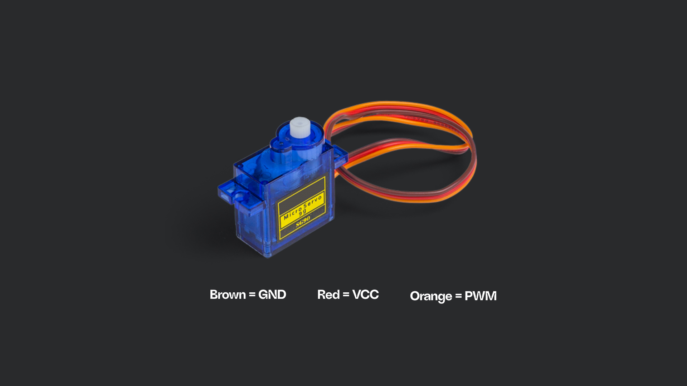
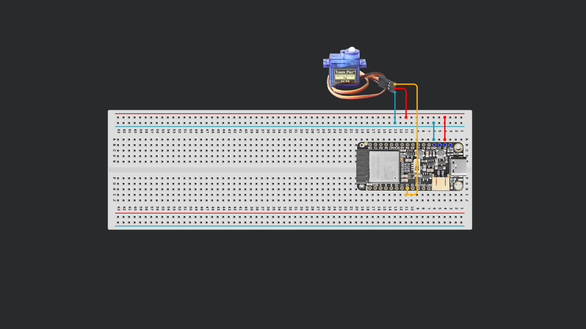
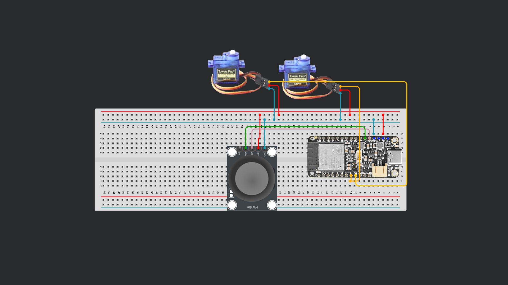

# Session 07




## 1. Driving a Servo Motor
A servo motor is a type of motor that can precisely control the position of its output shaft, allowing it to rotate to a specific angle within a set range, typically 0 to 180 degrees, but this can vary depending on the motor you have. We are working with the "SG90" type which accepts 3V – that means we can wire it directly to the ESP board.

1. **Wire the Servo.** Typically servos will have 3 connectors. VCC (Red), GND (Brown or Black) and PWM (Orange or White). We connect it to power and wire the PWM to Pin 12 on our board. 
2. **Install a library.** Open a new Arduino sketch and install the `ESP32Servo` Library by Kevin Harrington and John K. Bennett. After installing include it in your script:
   ```cpp
   #include <ESP32Servo.h>
   ```
3. **Choose a Pin.** We are using Pin 12 for our signal and defining a name for the servo.
   ```cpp
   int servoPin = 12:
   Servo myServo;
   ```

4. **Setup the Servo.** In the `void setup()` function, begin communication with your servo. Attach the servo to the pin and specify the pulse width range (in microseconds): `500` for the minimum angle (0°), and `2400` for the maximum angle (180°) for most SG90-type servos. To start, move the servo to the center (90°):
   ```cpp
   void setup() {
     myServo.attach(servoPin, 500, 2400);
     myServo.write(90);
   }
   ```

5. **Simple loop:** To make the servo sweep among 0°, 90°, and 180°, pausing for one second at each position:
   ```cpp
   void loop() {
     myServo.write(0);
     delay(1000);
     myServo.write(90);
     delay(1000);
     myServo.write(180);
     delay(1000);
   }
   ```

<details>
<summary>Optional: Define Speed with moveTo function</summary>

6. **Optional: Smooth Motion with `moveTo` Function:**  
   The basic code above moves the servo instantly between points. Often, you'd prefer smoother, slower, or more controlled motion. You can implement a `moveTo` function that smoothly transitions to a target angle at a specified speed (in degrees per second).

   Here's how you can define and use such a function:

   ```cpp
   // Move the servo smoothly to targetDeg at speedDegPerSec (degrees per second)
   static void moveTo(Servo &servo, int targetDeg, float speedDegPerSec) {
        targetDeg = constrain(targetDeg, 0, 180);
        float s = max(speedDegPerSec, 1.0f);
        unsigned long stepMs = (unsigned long)max(1.0f, 1000.0f / s); // 1 degree steps
        int pos = servo.read();

        while (pos != targetDeg) {
            pos += (pos < targetDeg) ? 1 : -1;
            servo.write(pos);
            delay(stepMs);
        }
    }
   ```
7. **Update Loop:**
   Now we update our `loop()` to use `moveTo()` with different speeds for each movement:

   ```cpp
   void loop() {
     moveTo(myServo, 0, 90.0f);     // Move to 0° at 90°/sec (fast)
     delay(1000);
     moveTo(myServo, 90, 15.0f);    // Move to 90° at 15°/sec (slow)
     delay(1000);
     moveTo(myServo, 180, 120.0f);  // Move to 180° at 120°/sec (very fast)
     delay(1000);
   }
   ```

</details>

<details>
<summary>Full Code</summary>

```cpp
#include <ESP32Servo.h>

int servoPin = 12; 
Servo myServo;

void setup() {
  myServo.attach(servoPin, 500, 2400);
  myServo.write(90);
}

void loop() {
  myServo.write(0);
  delay(1000);
  myServo.write(90);
  delay(1000);
  myServo.write(180);
  delay(1000);
}
```

</details>

## 2. Two or more Servos

1. **Wire a second servo** to Pin 13. 
2. **Write a program** that moves both servos at the same time and at different times. Extend the code from above. 


## 3. Control 2 Servos with Joystick
In this next example we will use our Joystick component to move our two servos. We will use the X and the Y axis to move them individually. 

1. **Wire the Joystick:** 5V to 3V (it's ok), GND to GND, VRx to A0, VRy to A1. SW can be left out – this is the button trigger when you press down. 
2. **Start from a simple two motor control code:**
   <details>
   <summary>Code</summary>

   ```cpp
   #include <ESP32Servo.h>

   int servoPin1 = 12; 
   int servoPin2 = 13;
   Servo myServo1;
   Servo myServo2;

   void setup() {
     myServo1.attach(servoPin1, 500, 2400);
     myServo2.attach(servoPin2, 500, 2400);
     myServo1.write(90);
     myServo2.write(90);
   }

   void loop() {
     myServo1.write(0);
     delay(1000);
     myServo1.write(90);
     delay(1000);
     myServo1.write(180);
     delay(1000);

     myServo2.write(0);
     delay(1000);
     myServo2.write(90);
     delay(1000);
     myServo2.write(180);
     delay(1000);
   }
   ```

  </details>

3. **Define the Joystick read Pins.** We are using A0 and A1 in this example.
   ```cpp
   int JoystickX = A0;  // VRx
   int JoystickY = A1  // VRy
   ```

4. **Write a function that reads out the X and Y axis of the joystick.** Pass the values. We need to write an `&` before the value to properly pass it. 
   ```cpp
   void readJoystick(int &x, int &y) {
    x = analogRead(JoystickX);
    y = analogRead(JoystickY);
   }
   ```

5. **Just add Serial begin** to the `void Setup()` function. The rest stays the same.
   ```cpp
   Serial.begin(9600);
   ```

6. **Read out the Joystick values** and print them so serial inside the `void loop()` function.
   ```cpp
   int x, y;
   readJoystick(x, y);

   Serial.print("x: ");
   Serial.print(x);
   Serial.print(" y: ");
   Serial.println(y);
   ```

7. **Map the values.** Still inside `void loop()`, we map and constrain the values of our Joystick reads to servo degrees. `constrain(inValue, minOut, maxOut)` makes sure the values cap at 0 and 180.
   ```cpp
   int a1 = map(x, 0, 4095, 0, 180);
   int a2 = map(y, 0, 4095, 0, 180);

   a1 = constrain(a1, 0, 180);
   a2 = constrain(a2, 0, 180);
   ```

8. **Move the servos.**
   ```cpp
   myServo.write(a1);
   myServo.write(a2);
   delay(10);
   ```

<details>
<summary>Optional: Deadzone to reduce jittering</summary>

1. **Deadzone:** If the value gets in a 80 units range from center move to 90 degrees. Add this before myServo1.write().
    ```cpp
    if (abs(x - 2048) < 80) a1 = 90;
    if (abs(y - 2048) < 80) a2 = 90;
    ```
</details>

<details>
<summary>Full Code</summary>

```cpp
#include <ESP32Servo.h>

int servoPin1 = 12; 
int servoPin2 = 13;
Servo myServo1;
Servo myServo2;

int JoystickX = A0;  // VRx
int JoystickY = A1;  // VRy

void readJoystick(int &x, int &y) {
  x = analogRead(JoystickX);
  y = analogRead(JoystickY);
}

void setup() {
  Serial.begin(9600);
  myServo1.attach(servoPin1, 500, 2400);
  myServo2.attach(servoPin2, 500, 2400);
  myServo1.write(90);
  myServo2.write(90);
}

void loop() {
  int x, y;
  readJoystick(x, y);

  Serial.print("x: ");
  Serial.print(x);
  Serial.print(" y: ");
  Serial.println(y);


  int a1 = map(x, 0, 4095, 0, 180);
  int a2 = map(y, 0, 4095, 0, 180);

  a1 = constrain(a1, 0, 180);
  a2 = constrain(a2, 0, 180);

  /* simple deadzone around center (~2048) to reduce jitter
  if (abs(x - 2048) < 80) a1 = 90;
  if (abs(y - 2048) < 80) a2 = 90;
  */
  myServo1.write(a1);
  myServo2.write(a2);
  delay(10);
}
```

</details>

## 4. Control Servos via OSC

As we sent OSC Messages in the previous lesson, we can also use incoming OSC Messages and their appended values to drive things.

### Apps
**Android:**
- OSC Controller:https://play.google.com/store/apps/details?id=com.ffsmultimedia.osccontroller

**iOS:** 
- Data OSC: https://apps.apple.com/at/app/data-osc/id6447833736?l=en-GB
- ZIG SIM: https://apps.apple.com/at/app/zig-sim/id1112909974?l=en-GB

### Code

1. **Base:** Lets's modify the previous example to use incoming OSC values. Delete anything related to Sensor reading but we keep the mapping.
   
   <details>
    <summary>Full Code</summary>

    ```cpp
    #include <ESP32Servo.h>

    int servoPin1 = 12; 
    int servoPin2 = 13;
    Servo myServo1;
    Servo myServo2;

    int JoystickX = A0;  // VRx
    int JoystickY = A1;  // VRy

    void readJoystick(int &x, int &y) {
    x = analogRead(JoystickX);
    y = analogRead(JoystickY);
    }

    void setup() {
    Serial.begin(9600);
    myServo1.attach(servoPin1, 500, 2400);
    myServo2.attach(servoPin2, 500, 2400);
    myServo1.write(90);
    myServo2.write(90);
    }

    void loop() {
    int x, y;
    readJoystick(x, y);

    Serial.print("x: ");
    Serial.print(x);
    Serial.print(" y: ");
    Serial.println(y);


    int a1 = map(x, 0, 4095, 0, 180);
    int a2 = map(y, 0, 4095, 0, 180);

    a1 = constrain(a1, 0, 180);
    a2 = constrain(a2, 0, 180);

    /* simple deadzone around center (~2048) to reduce jitter
    if (abs(x - 2048) < 80) a1 = 90;
    if (abs(y - 2048) < 80) a2 = 90;
    */
    myServo1.write(a1);
    myServo2.write(a2);
    delay(10);
    }
    ```

    </details>

2. **Import Libraries.** Of course, we need our WiFi and OSC Stuff again:
   ```cpp
   #include <WiFi.h>
   #include <WiFiUdp.h>
   #include <OSCMessage.h>
   #include <OSCBundle.h>
   #include <OSCData.h>
   ```

3. **Define WiFi and Port Credentials.** 
   ```cpp
   char ssid[] = "***";     
   char pass[] = "***";           

   const unsigned int localPort = 8000;

   OSCErrorCode error;
   WiFiUDP Udp;

   unsigned long lastPacketMs = 0;
   ```

4. **Begin WiFi and Serial Communication** inside our `void setup()`function. If we put it before `myServo1.write(90)` the initial movement of the servos become like a "ready" signal.
   ```cpp
   WiFi.begin(ssid, pass);

   while (WiFi.status() != WL_CONNECTED) {
        delay(500);
        Serial.print(".");
   }
   Serial.println("WiFi connected");
   Serial.print("IP address: ");
   Serial.println(WiFi.localIP());

   Udp.begin(localPort);
   ```
5. **Receive Message and filter by its address.** OSC Messages have addresses that make it possible to differentiate between them. In the following piece of code, we await a message and check it for errors and of the address is correct. Then we read out its value. This happens inside of `void loop()`.
   ```cpp
   int size = Udp.parsePacket();

   if (size > 0) {
    OSCMessage msg;
    while (size--) msg.fill(Udp.read());

    if (!msg.hasError()) {
        if(msg.fullMatch("/data/faceTracking/face/position/x")) {
            float gyroX = msg.getFloat(0);
        }
    }
   }
   ```

6. **Print out the read message** and run the program see what's coming in.
   ```cpp
   Serial.println(gyroX);

7. **Float to Int:** map() does not accept a mixture of float and int. To solve that, we simply multiply by 1000.
   ```cpp
   int x = gyroX * 1000;
   Serial.println(x);
   ```

8. **Map and constrain**
   ```cpp
   int a1 = map(x, -1000, 1000, 0, 180);

   a1 = constrain(a1, 0, 180);

   myServo1.write(a1);

   delay(10);
   ```

9. **Add Y Axis too.**
    ```cpp
    else if (msg.fullMatch("/data/faceTracking/face/rotation/y")) {
        gyroY = msg.getFloat(0);
    } // ... continue yourself!
    ```

10. **Finish the second axis yourself**

<details>
<summary>Full Code</summary>

NOCOPYYY 

</details> 


## 5. Simple Webserver

The ESP is also able to host simple Webpages, which you can easily access via the local network. We can display data, or control stuff from these simple pages. 

1. **Imports and Credentials.** Additionally to the known WiFi Library we will also use the Webserver Library. No Download necessary.
   ```cpp
   #include <WiFi.h>
   #include <WebServer.h>

   const char* ssid     = "***";
   const char* password = "***";
   ```

2. **Register a route.** 
   ```cpp
   WebServer server(80);

   void handleRoot() {
    server.send(200, "text/html", "<h1>Hello from ESP32!</h1>");
   }
   ```

3. **Setup: Connect to Wifi and begin server.**
   ```cpp
   void setup() {
    Serial.begin(115200);

    WiFi.begin(ssid, password);
    while (WiFi.status() != WL_CONNECTED) {
        delay(500);
        Serial.print(".");
    }
    Serial.println(WiFi.localIP());

    server.on("/", handleRoot);
    server.begin();
   }
   ```

4. **Loop:** Handle Client
   ```cpp
   void loop() {
     server.handleClient();
   }
   ```

5. **Run** and open in the IP displayed in your serial port in your browser.


## 6. Control Motors via Webserver

```cpp
#include <WiFi.h>
#include <WebServer.h>
#include <ESP32Servo.h>

const char *ssid = "***";
const char *password = "***";

const int servoPin1 = 12;
const int servoPin2 = 13;

Servo myServo1;
Servo myServo2;
WebServer server(80);

int angle1 = 90;
int angle2 = 90;

void handleRoot() {
  if (server.hasArg("m1")) {
    angle1 = constrain(server.arg("m1").toInt(), 0, 180);
    myServo1.write(angle1);
  }
  if (server.hasArg("m2")) {
    angle2 = constrain(server.arg("m2").toInt(), 0, 180);
    myServo2.write(angle2);
  }

  char buf[384];
  snprintf(
      buf, sizeof(buf),
      "<!DOCTYPE html><meta charset=utf-8>"
      "<form method=get>"
      "<input type=range name=m1 min=0 max=180 value=%d onchange=this.form.submit()>"
      "<input type=range name=m2 min=0 max=180 value=%d onchange=this.form.submit()>"
      "</form>",
      angle1, angle2);
  server.send(200, "text/html", buf);
}

void setup() {
  Serial.begin(115200);
  delay(200);

  myServo1.attach(servoPin1, 500, 2400);
  myServo2.attach(servoPin2, 500, 2400);
  myServo1.write(angle1);
  myServo2.write(angle2);

  WiFi.mode(WIFI_STA);
  WiFi.begin(ssid, password);
  Serial.print("Connecting");
  while (WiFi.status() != WL_CONNECTED) {
    delay(500);
    Serial.print(".");
  }
  Serial.println();
  Serial.println(WiFi.localIP());

  server.on("/", HTTP_GET, handleRoot);
  server.begin();
}

void loop() {
  server.handleClient();
}
```
