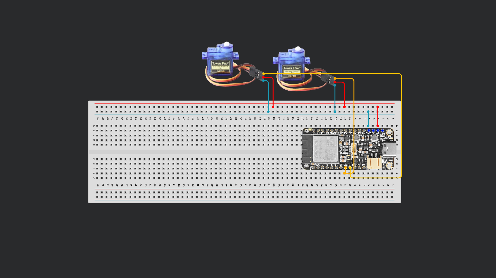
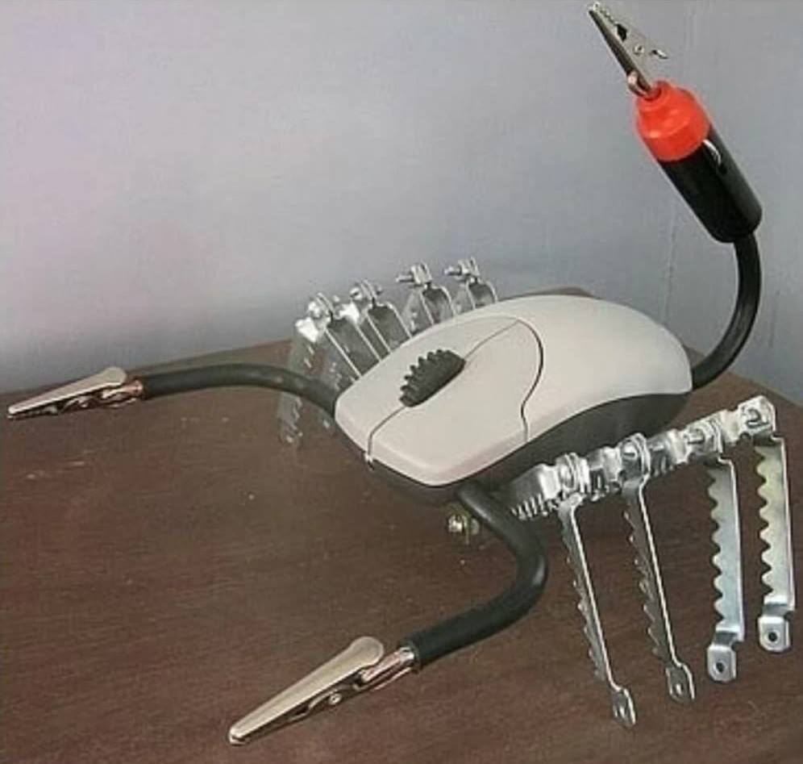
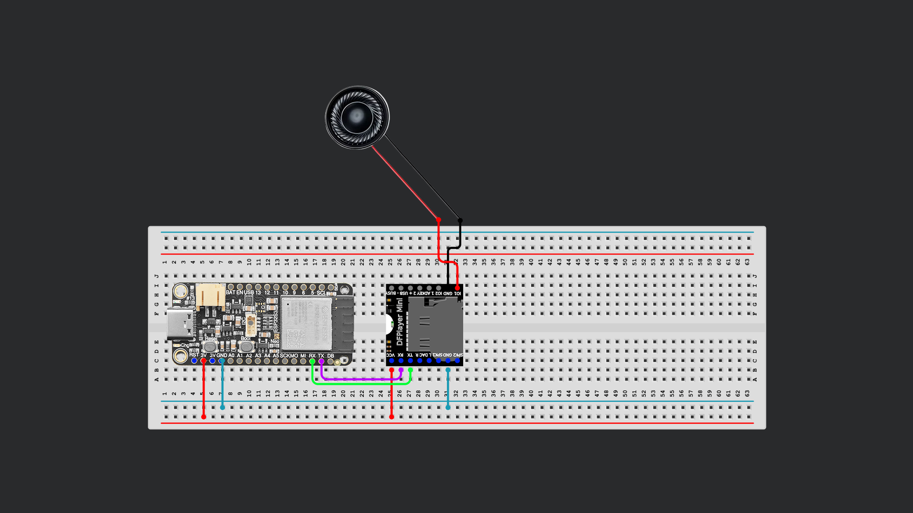
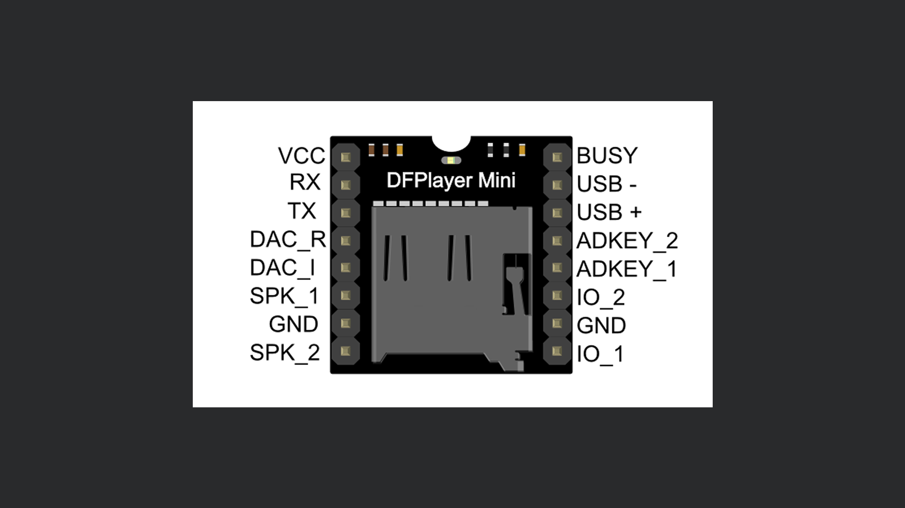

# Session 08


## 1. Control Servos via OSC

As we sent OSC Messages in the previous lesson, we can also use incoming OSC Messages and their appended values to drive things.

### Wiring
Please (re)attach the two motors to pin 12 and 13 like in the schematic:


### Apps
**Desktop**
- TouchOSC (Will ask you for a licence, but works) https://hexler.net/touchosc#_

**Android:**
- OSC Controller:https://play.google.com/store/apps/details?id=com.ffsmultimedia.osccontroller
- Sensors2OSC: https://f-droid.org/packages/org.sensors2.osc/ (From F-Droid Store, you might need to install that first?)
- TouchOSC (€22,99)

**iOS:** 
- Data OSC: https://apps.apple.com/at/app/data-osc/id6447833736?l=en-GB
- ZIG SIM: https://apps.apple.com/at/app/zig-sim/id1112909974?l=en-GB
- TouchOSC (€19,99)
 

### Send OSC Values from your phone to your Laptop

1. Make sure your phone and your laptop are on the same network (TotalViewer)
2. Find out the IP-Address of your laptop and set it in the app on your phone
3. In Protocol, read out the messages and note down the address path.
   ```js
   // Touch OSC Example
   ADDRESS(/encoder1) FLOAT(0.22863423)
   // Data OSC Example
   ADDRESS(/data/motion/gyroscope/y) FLOAT(0.0072272867)
   //ZIG SIM Example
   ADDRESS(/ZIGSIM/DRONE/gyro) FLOAT(-0.62390506)
   ```


### Code

1. **Base:** Lets's modify the previous example to use incoming OSC values. Delete anything related to Sensor reading but we keep the mapping.
   
   <details>
    <summary>Full Code</summary>

    ```cpp
    #include <ESP32Servo.h>

    int servoPin1 = 12; 
    int servoPin2 = 13;
    Servo myServo1;
    Servo myServo2;

    int JoystickX = A0;  // VRx
    int JoystickY = A1;  // VRy

    void readJoystick(int &x, int &y) {
    x = analogRead(JoystickX);
    y = analogRead(JoystickY);
    }

    void setup() {
    Serial.begin(9600);
    myServo1.attach(servoPin1, 500, 2400);
    myServo2.attach(servoPin2, 500, 2400);
    myServo1.write(90);
    myServo2.write(90);
    }

    void loop() {
    int x, y;
    readJoystick(x, y);

    Serial.print("x: ");
    Serial.print(x);
    Serial.print(" y: ");
    Serial.println(y);


    int a1 = map(x, 0, 4095, 0, 180);
    int a2 = map(y, 0, 4095, 0, 180);

    a1 = constrain(a1, 0, 180);
    a2 = constrain(a2, 0, 180);

    /* simple deadzone around center (~2048) to reduce jitter
    if (abs(x - 2048) < 80) a1 = 90;
    if (abs(y - 2048) < 80) a2 = 90;
    */
    myServo1.write(a1);
    myServo2.write(a2);
    delay(10);
    }
    ```

    </details>

2. **Import Libraries.** Of course, we need our WiFi and OSC Stuff again:
   ```cpp
   #include <WiFi.h>
   #include <WiFiUdp.h>
   #include <OSCMessage.h>
   #include <OSCBundle.h>
   #include <OSCData.h>
   ```

3. **Define WiFi and Port Credentials.** 
   ```cpp
   char ssid[] = "***";     
   char pass[] = "***";           

   const unsigned int localPort = 8000;

   OSCErrorCode error;
   WiFiUDP Udp;

   unsigned long lastPacketMs = 0;
   ```

4. **Begin WiFi and Serial Communication** inside our `void setup()`function. If we put it before `myServo1.write(90)` the initial movement of the servos become like a "ready" signal.
   ```cpp
   WiFi.begin(ssid, pass);

   while (WiFi.status() != WL_CONNECTED) {
        delay(500);
        Serial.print(".");
   }
   Serial.println("WiFi connected");
   Serial.print("IP address: ");
   Serial.println(WiFi.localIP());

   Udp.begin(localPort);
   ```
5. **Receive Message and filter by its address.** OSC Messages have addresses that make it possible to differentiate between them. In the following piece of code, we await a message and check it for errors and of the address is correct. Then we read out its value. This happens inside of `void loop()`.
   ```cpp
   int size = Udp.parsePacket();

   if (size > 0) {
    OSCMessage msg;
    while (size--) msg.fill(Udp.read());

    if (!msg.hasError()) {
        if(msg.fullMatch("/data/faceTracking/face/position/x")) {
            float gyroX = msg.getFloat(0);
        }
    }
   }
   ```

6. **Print out the read message** and run the program see what's coming in.
   ```cpp
   Serial.println(gyroX);

7. **Float to Int:** map() does not accept a mixture of float and int. To solve that, we simply multiply by 1000.
   ```cpp
   int x = gyroX * 1000;
   Serial.println(x);
   ```

8. **Map and constrain**
   ```cpp
   int a1 = map(x, -1000, 1000, 0, 180);

   a1 = constrain(a1, 0, 180);

   myServo1.write(a1);

   delay(10);
   ```

9. **Add Y Axis too.**
    ```cpp
    else if (msg.fullMatch("/data/faceTracking/face/rotation/y")) {
        gyroY = msg.getFloat(0);
    } // ... continue yourself!
    ```

10. **Finish the second axis yourself**

<details>
<summary>Full Code</summary>

NOCOPYYY 

</details> 


## 2. Simple Webserver

The ESP is also able to host simple Webpages, which you can easily access via the local network. We can display data, or control stuff from these simple pages. 

1. **Imports and Credentials.** Additionally to the known WiFi Library we will also use the Webserver Library. No Download necessary.
   ```cpp
   #include <WiFi.h>
   #include <WebServer.h>

   const char *ssid     = "***";
   const char *password = "***";
   ```

2. **Register a route.** 
   ```cpp
   WebServer server(80);

   void handleRoot() {
    server.send(200, "text/html", "<h1>Hello from ESP32!</h1>");
   }
   ```

3. **Setup: Connect to Wifi and begin server.**
   ```cpp
   void setup() {
    Serial.begin(115200);

    WiFi.begin(ssid, password);
    while (WiFi.status() != WL_CONNECTED) {
        delay(500);
        Serial.print(".");
    }
    Serial.println(WiFi.localIP());

    server.on("/", HTTP_GET, handleRoot);
    server.begin();
   }
   ```

4. **Loop:** Handle Client
   ```cpp
   void loop() {
     server.handleClient();
   }
   ```

5. **Run** and open in the IP displayed in your serial port in your browser.

<details>
<summary>Full Code</summary>

```cpp
#include <WiFi.h>
#include <WebServer.h>

const char *ssid     = "***";
const char *password = "***";

WebServer server(80);

void handleRoot() {
  server.send(200, "text/html", "<h1>Hello from ESP32!</h1>");
}

void setup() {
  Serial.begin(115200);

  WiFi.begin(ssid, password);
  while (WiFi.status() != WL_CONNECTED) {
    delay(500);
    Serial.print(".");
  }
  Serial.println(WiFi.localIP());

  server.on("/", HTTP_GET, handleRoot);
  server.begin();
}

void loop() {
  server.handleClient();
}
```

</details>


## 3. Control Motors via Webserver
Lets extend our Simple Webserver example from above to control our motors. For this we need to reintroduce code from our two motors example.

1. **Include Servo Library**
   ```cpp
   #include <ESP32Servo.h>
   ```


2. **Set Pin definitions and variables.** We had our motors connected to Pins 12 and 13. Additionally lets define a global variable for the motor angle, we will need it later.
   ```cpp
   const int servoPin1 = 12;
   const int servoPin2 = 13;

   Servo myServo1;
   Servo myServo2;

   int angle1 = 90;
   int angle2 = 90;
   ```

3. **A webpage with two sliders.** In `void handleRoot()`, we want to build a simple html page that sends the values of two sliders everytime the user moves them. We define a fixed array of characters to store our webpage – we basically count the letters of our html + the values we send + a little padding for safety. Let's say about 400 characters.
   ```cpp
   char buf[400];
   snprintf(
      buf, sizeof(buf),
      "<!DOCTYPE html><meta charset=utf-8>"
      "<form method=get>"
      "<input type=range name=m1 min=0 max=180 value=%d onchange=this.form.submit()>"
      "<input type=range name=m2 min=0 max=180 value=%d onchange=this.form.submit()>"
      "</form>",
      angle1, angle2);
   server.send(200, "text/html", buf);
   ```

4. We wrote the html that renders the sliders for us, but we still need to read out the values from the slides and move the motors. Lets do this still inside `void handleRoot()` and before `char buf[400];`. The function `toInt()` makes sure we only send whole numbers.
   ```cpp
   if (server.hasArg("m1")) {
      angle1 = constrain(server.arg("m1").toInt(), 0, 180);
      myServo1.write(angle1);
   }
   if (server.hasArg("m2")) {
      angle2 = constrain(server.arg("m2").toInt(), 0, 180);
      myServo2.write(angle2);
   }
   ```

5. **Setup Function.** Here we still need to add our Servo functionality. Inside `void setup()` add:
   ```cpp
   myServo1.attach(servoPin1, 500, 2400);
   myServo2.attach(servoPin2, 500, 2400);
   myServo1.write(angle1);
   myServo2.write(angle2);
   ```


<details>
<summary>Full Code</summary>

```cpp
#include <WiFi.h>
#include <WebServer.h>
#include <ESP32Servo.h>

const char *ssid = "***";
const char *password = "***";

const int servoPin1 = 12;
const int servoPin2 = 13;

Servo myServo1;
Servo myServo2;
WebServer server(80);

int angle1 = 90;
int angle2 = 90;

void handleRoot() {
  if (server.hasArg("m1")) {
    angle1 = constrain(server.arg("m1").toInt(), 0, 180);
    myServo1.write(angle1);
  }
  if (server.hasArg("m2")) {
    angle2 = constrain(server.arg("m2").toInt(), 0, 180);
    myServo2.write(angle2);
  }

  char buf[400];
  snprintf(
      buf, sizeof(buf),
      "<!DOCTYPE html><meta charset=utf-8>"
      "<form method=get>"
      "<input type=range name=m1 min=0 max=180 value=%d onchange=this.form.submit()>"
      "<input type=range name=m2 min=0 max=180 value=%d onchange=this.form.submit()>"
      "</form>",
      angle1, angle2);
  server.send(200, "text/html", buf);
}

void setup() {
  Serial.begin(115200);
  delay(200);

  myServo1.attach(servoPin1, 500, 2400);
  myServo2.attach(servoPin2, 500, 2400);
  myServo1.write(angle1);
  myServo2.write(angle2);

  WiFi.mode(WIFI_STA);
  WiFi.begin(ssid, password);
  Serial.print("Connecting");
  while (WiFi.status() != WL_CONNECTED) {
    delay(500);
    Serial.print(".");
  }
  Serial.println();
  Serial.println(WiFi.localIP());

  server.on("/", HTTP_GET, handleRoot);
  server.begin();
}

void loop() {
  server.handleClient();
}
```

</details>


## 4. Play Sounds with DF Player Mini

The DFPlayer Mini is a small, low-cost MP3 module that can play audio files directly from a microSD card. It is used to add sound, music, or voice playback with just a few simple connections and commands. I noticed that .mp3 files generally work the best.

On the SD Card are 10 Sounds of a robot voice counting from 1-10
```
0001.mp3
0002.mp3
...
0009.mp3
0010.mp3
```

Lets just play these sounds. 

### Wiring



### Code
1. **Install Libary.** For this exmaple we use the `DFRobotDFPlayerMini` library by DFRobot. Install it through the library manager.
2. **Import Library.** 
   ```cpp
   #include "DFRobotDFPlayerMini.h"
   ```
3. **Definitions**
   ```cpp
   #define FPSerial Serial2
   #define DFPLAYER_RX_PIN 38
   #define DFPLAYER_TX_PIN 39

   DFRobotDFPlayerMini myDFPlayer;
   ```

4. **Setup Function.** We begin not only Serial communication to our Laptop – we also start it with the DFPlayer through the RX and TX Pins. We implement a simple check: Print a success message if communication was successful, and an error if not. Finally we set the volume of the player. I suggest a value between 5-10;
   ```cpp
   void setup() {
      FPSerial.begin(9600, SERIAL_8N1, DFPLAYER_RX_PIN, DFPLAYER_TX_PIN);
      Serial.begin(115200);

      if (!myDFPlayer.begin(FPSerial)) {
         Serial.println("Unable to begin:");
      }
   Serial.println("DFPlayer Mini online.");

   myDFPlayer.volume(10); // Set volume value. From 0 to 30
   }
   ```

5. **Play Sounds 1 and 2** with a delay of two seconds.
   ```cpp
   void loop() {
      myDFPlayer.play(1);
      delay(2000);
      myDFPlayer.play(2);
      delay(2000);
   }
   ```

6. Alternatively we can loop through the sound with a simple counting for loop. We define an `int i` at one. For each loop iteration, it counts up 1 until it reaches 10. 
   ```cpp
   void loop() {
      for (int i = 1; i <= 10; i++) {
         myDFPlayer.play(i);
         delay(2000);
         Serial.println(i);
      }
   }
   ```

<details>
<summary>Full Code</summary>

```cpp
#include "DFRobotDFPlayerMini.h"

#define FPSerial Serial2
#define DFPLAYER_RX_PIN 38
#define DFPLAYER_TX_PIN 39

DFRobotDFPlayerMini myDFPlayer;

void setup() {
  FPSerial.begin(9600, SERIAL_8N1, DFPLAYER_RX_PIN, DFPLAYER_TX_PIN);
  Serial.begin(115200);

  if (!myDFPlayer.begin(FPSerial)) {
    Serial.println("Unable to begin:");
  }
  Serial.println("DFPlayer Mini online.");

  myDFPlayer.volume(2); // Set volume value. From 0 to 30
}
/*
void loop() {
  myDFPlayer.play(1);
  delay(2000);
  myDFPlayer.play(2);
  delay(2000);
}
*/

void loop() {
  for (int i = 1; i <= 10; i++) {
    myDFPlayer.play(i);
    delay(2000);
    Serial.println(i);
  }
}
```

</details>

<details>
<summary>Start Stop Butto Code</summary>

```cpp
#include "DFRobotDFPlayerMini.h"

#define FPSerial Serial2
#define DFPLAYER_RX_PIN 38
#define DFPLAYER_TX_PIN 39
#define BTN_PIN 0  // built-in BOOT button (or wire a switch: pin -> GND)

DFRobotDFPlayerMini myDFPlayer;
bool playing = true;
int track = 1;

void setup() {
  pinMode(BTN_PIN, INPUT_PULLUP);
  FPSerial.begin(9600, SERIAL_8N1, DFPLAYER_RX_PIN, DFPLAYER_TX_PIN);
  Serial.begin(115200);

  if (!myDFPlayer.begin(FPSerial)) {
    Serial.println("Unable to begin:");
  }
  Serial.println("DFPlayer Mini online.");

  myDFPlayer.volume(2);
  myDFPlayer.play(track);
}

void loop() {
  if (digitalRead(BTN_PIN) == LOW) {
    delay(200);
    if (digitalRead(BTN_PIN) == LOW) {
      playing = !playing;
      if (playing) {
        myDFPlayer.play(track);
        Serial.println("play");
      } else {
        myDFPlayer.stop();
        Serial.println("stop");
      }
      while (digitalRead(BTN_PIN) == LOW) {
        delay(10);
      }
    }
  }

  if (!playing) {
    return;
  }

  delay(2000);
  track++;
  if (track > 10) {
    track = 1;
  }
  myDFPlayer.play(track);
  Serial.println(track);
}
```

</details>

## 5. Find near Bluetooth devices
With the built in Bluetooth module, the ESP allows us to sniff for for nearby Bluetooth devices. We can not only count or list them, but also measure their signal strength – which works a bit like a proximity sensor for phones, wireless headphones or any other bluetooth device.

1. **Libraries.** The Bluetooth library should already come preinstalled, so no need to download it.
   ```cpp
   #include <BLEDevice.h>
   #include <BLEScan.h>
   ```

2. **Variables.** Let'S define two variables: How long we will be scanning for and how long the pause should be. Let's set both to 1 second. 
   ```cpp
   int scanSeconds = 1000;
   int pauseSeconds = 1000;
   ```

3. **Setup.** We start serial comm plus initialize the BLE Device
   ```cpp
   void setup() {
      Serial.begin(115200);
      delay(500);

      BLEDevice::init("");
   }
   ```

4. **BT Scan.** Inside `void loop()` we start to scan for Devices around us. `scanner.start()` takes seconds as input.
   ```cpp
   void loop() {
      BLEScan& scanner = *BLEDevice::getScan();
      scanner.setActiveScan(true);
      scanner.start(scanSeconds, false);
   }
   ```

5. **Count and Print nearby devices.** We define an integer and try to read the results from the scanner.
   ```cpp
   int numberOfDevices;

   BLEScanResults& results = *scanner.getResults();
   numberOfDevices = results.getCount();

   Serial.print("BLE devices nearby: ");
   Serial.println(numberOfDevices);
   ```

6. **Clear the results and wait a second.** Upload and see how many bluetooth devices there are around.
   ```cpp
   scanner.clearResults();
   delay(pauseSeconds * 1000);
   ```

7. **Filter by Signal Strength.** To make this a better proximity sensor, we need to filter out only the devices with a "loud" signal – these should be the devices close to your ESP. In the global variables at the top of the script we set a threshold (in dBm)
   ```cpp
   int closeThresholdDbm = -55;
   ```

8. **Check the signal strength for each found nearby device.** We do this with a for loop that iterates through all devices. We also define a variable for the close devices and set it to 0;
   ```cpp
   int closeDevices = 0;
   for (int i = 0; i < numberOfDevices; i++) {
      if (results.getDevice(i).getRSSI() >= closeThresholdDbm) {
         closeDevices++;
      }
   }
   ```

9. **Print results**
   ```cpp
   Serial.print("BLE devices within ");
   Serial.print(closeThresholdDbm);
   Serial.print(" dBm RSSI (close): ");
   Serial.print(closeDevices);
   Serial.print(" / ");
   Serial.println(numberOfDevices);
   ```

10. Add sound functionality (:

<details>
<summary>Count BT Devices</summary>

```cpp
#include <BLEDevice.h>
#include <BLEScan.h>

int scanSeconds = 5;
int pauseSeconds = 3;

void setup() {
  Serial.begin(115200);
  delay(500);

  BLEDevice::init("");
}

void loop() {

  BLEScan& scanner = *BLEDevice::getScan();
  scanner.setActiveScan(true);

  scanner.start(scanSeconds, false);

  int numberOfDevices;

  BLEScanResults& results = *scanner.getResults();
  numberOfDevices = results.getCount();

  Serial.print("BLE devices nearby: ");
  Serial.println(numberOfDevices);

  scanner.clearResults();
  delay(pauseSeconds * 1000);
}
```
</details>
<details>
<summary>Filter BT Devices</summary>

```cpp
#include <BLEDevice.h>
#include <BLEScan.h>

int scanSeconds = 1;
int pauseSeconds = 1;

// RSSI is in dBm; e.g. -50 is closer than -60.
int closeThresholdDbm = -55;

void setup() {
  Serial.begin(115200);
  delay(500);

  BLEDevice::init("");
}

void loop() {
  BLEScan& scanner = *BLEDevice::getScan();
  scanner.setActiveScan(true);

  scanner.start(scanSeconds, false);

  BLEScanResults& results = *scanner.getResults();
  const int numberOfDevices = results.getCount();
  int closeDevices = 0;
  for (int i = 0; i < numberOfDevices; i++) {
    if (results.getDevice(i).getRSSI() >= closeThresholdDbm) {
      closeDevices++;
    }
  }

  Serial.print("BLE devices within ");
  Serial.print(closeThresholdDbm);
  Serial.print(" dBm RSSI (close): ");
  Serial.print(closeDevices);
  Serial.print(" / ");
  Serial.println(numberOfDevices);

  scanner.clearResults();
  delay(pauseSeconds * 1000);
}
```

</details>

